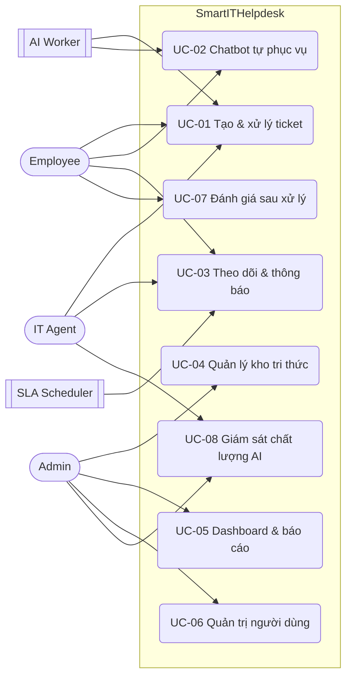

# 01 — Phân tích Yêu cầu (Requirement Analysis)

| | |
|---|---|
| Dự án | Smart IT Helpdesk — Hệ thống hỗ trợ IT nội bộ tích hợp AI |
| Phiên bản | 1.0 |
| Ngày | 2026-07-30 |
| Tác giả | Bùi Mậu Văn (Scrum Master / AI Engineer) |
| Người duyệt | Trainer (Product Owner) |
| Trạng thái | Draft — chờ review với PO |

---

## 1. Bối cảnh và vấn đề

Yêu cầu hỗ trợ IT nội bộ hiện được xử lý rời rạc qua email và chat. Hệ quả đo được:

| Vấn đề hiện tại | Biểu hiện | Cái giá phải trả |
|---|---|---|
| Không có nơi lưu trữ tập trung | Yêu cầu nằm rải rác trong inbox cá nhân | Yêu cầu bị bỏ sót, không ai chịu trách nhiệm |
| Không có trạng thái | Nhân viên phải hỏi lại "đến đâu rồi?" | IT tốn thời gian trả lời câu hỏi về tiến độ |
| Không có phân loại/định tuyến | Ticket đến sai người, phải chuyển tay | Thời gian phản hồi đầu tiên kéo dài |
| Lặp lại câu trả lời quen thuộc | ~40% yêu cầu là câu hỏi đã có tài liệu | IT không còn thời gian cho sự cố phức tạp |
| Không có dữ liệu | Không biết hiệu suất đội IT ra sao | Không thể cải tiến, không thể phân bổ nhân sự |

> **Ghi chú giả định:** con số 40% là ước lượng chưa được xác thực. Cần hỏi PO trong buổi họp tuần 1. Nếu con số thực < 15%, giá trị của F4 (Chatbot RAG) giảm đáng kể và cần cân nhắc lại thứ tự ưu tiên.

## 2. Mục tiêu (Goals)

Xếp theo thứ tự ưu tiên. **Hai mục tiêu đầu định hình kiến trúc**, các mục tiêu sau không được phá vỡ chúng.

| # | Mục tiêu | Đo bằng gì |
|---|---|---|
| G1 | Tập trung hoá 100% yêu cầu hỗ trợ IT vào một hệ thống, có trạng thái và người phụ trách rõ ràng | Mọi ticket đều có `status` và `assignee` sau ≤ 5 phút kể từ khi tạo |
| G2 | Tự động phân loại và định tuyến ticket bằng AI | ≥ 70% ticket được AI gán đúng category (đo bằng tỉ lệ Agent không sửa lại) |
| G3 | Giảm tải cho đội IT bằng chatbot RAG trên kho tri thức nội bộ | ≥ 20% phiên chat kết thúc mà không tạo ticket |
| G4 | Minh bạch hiệu suất qua dashboard | Admin xem được 6 chỉ số ở mục 4.7 mà không cần truy vấn thủ công |
| G5 | Bảo mật: JWT access/refresh + phân quyền theo vai trò | 0 endpoint nghiệp vụ không được bảo vệ (kiểm chứng bằng test) |

## 3. Phạm vi KHÔNG làm (Non-goals)

**Đây là mục quan trọng nhất tài liệu này.** Mọi đề xuất nằm ngoài phạm vi phải được PO duyệt và đưa vào backlog sprint sau, không được lén thêm vào sprint hiện tại.

| Không làm | Lý do |
|---|---|
| Tích hợp SSO / Active Directory / LDAP | Không có hệ thống thật để tích hợp trong môi trường mock; dùng tài khoản nội bộ |
| Tạo ticket từ email đến (inbound email-to-ticket) | Cần mail server + parsing; chi phí cao so với giá trị demo |
| Multi-tenant (nhiều công ty trên một hệ thống) | Chỉ phục vụ một tổ chức. Tuy nhiên **vẫn thiết kế `department_id` để phân vùng dữ liệu** (xem §7 tài liệu 04) |
| Ứng dụng mobile native | Web responsive là đủ |
| Fine-tune / self-host LLM | Dùng LLM API sẵn có. Chỉ làm prompt engineering + RAG |
| Quản lý tài sản CNTT (IT Asset/CMDB) | Là một sản phẩm riêng, không thuộc phạm vi helpdesk |
| Quy trình ITIL đầy đủ (Change/Problem/Release Management) | Chỉ làm Incident + Service Request |
| Đa ngôn ngữ (i18n) | Giao diện tiếng Việt |
| Realtime collaborative editing | Không có nhu cầu nghiệp vụ |
| Xuất báo cáo PDF/Excel | Bonus, chỉ làm nếu Sprint 2 còn thời gian. CSV là bắt buộc tối thiểu |
| Cuộc gọi/video hỗ trợ từ xa | Ngoài phạm vi |

## 4. Đối tượng người dùng (Actors)

### 4.1 Actor người

| Actor | Số lượng ước tính | Mục tiêu chính | Tần suất dùng |
|---|---|---|---|
| **Employee** (Nhân viên) | ~1.000 | Được giải quyết sự cố nhanh nhất có thể | Vài lần/tháng |
| **IT Agent** (Nhân viên IT) | ~20 | Xử lý đúng thứ tự ưu tiên, không bị quá tải | Cả ngày làm việc |
| **Admin** (Quản trị viên) | ~3 | Nắm hiệu suất, quản lý người dùng và kho tri thức | Vài lần/tuần |

### 4.2 Actor hệ thống

| Actor | Vai trò |
|---|---|
| **AI Classifier Worker** | Tiến trình nền: đọc ticket mới → gán category/priority → gợi ý assignee |
| **RAG Pipeline** | Tiến trình nền: chia nhỏ + embedding tài liệu khi Admin publish |
| **SLA Scheduler** | Job định kỳ: quét ticket sắp/đã trễ hạn → sinh thông báo |
| **Notification Worker** | Tiến trình nền: gửi thông báo in-app (và email nếu có) |
| **LLM Provider** | Dịch vụ bên thứ ba (bên ngoài trust boundary) |

## 5. Use case chính

Xếp hạng. UC-01 và UC-02 định hình kiến trúc.

| # | Use case | Actor | Mô tả một câu | Feature |
|---|---|---|---|---|
| UC-01 | Tạo và xử lý ticket | Employee, IT Agent | Nhân viên tạo yêu cầu → AI phân loại & định tuyến → Agent xử lý → đóng ticket | F2, F3 |
| UC-02 | Tự phục vụ bằng chatbot | Employee | Nhân viên hỏi chatbot trước, chỉ tạo ticket khi chatbot không giải quyết được | F4, F5 |
| UC-03 | Theo dõi tiến độ | Employee | Nhân viên xem trạng thái ticket của mình và nhận thông báo khi có cập nhật | F2, F6 |
| UC-04 | Quản lý kho tri thức | Admin | Admin đăng/sửa/phân loại tài liệu; hệ thống tự index cho chatbot | F5, F4 |
| UC-05 | Giám sát hiệu suất | Admin | Admin xem dashboard số ticket, thời gian xử lý, workload, điểm hài lòng | F7, F8 |
| UC-06 | Quản trị người dùng & phân quyền | Admin | Admin tạo/khoá tài khoản, gán vai trò | F1 |
| UC-07 | Đánh giá sau xử lý | Employee | Nhân viên chấm điểm hài lòng sau khi ticket đóng | F8 |
| UC-08 | Cải thiện AI | Admin, IT Agent | Xem độ chính xác phân loại và các câu chatbot trả lời kém để bổ sung tài liệu | F3, F4 |

### Sơ đồ Use Case



## 6. Yêu cầu chức năng (Functional Requirements)

Ánh xạ từ 8 Feature trong tài liệu mô tả dự án. Chi tiết User Story và tiêu chí chấp nhận nằm ở tài liệu **02-user-stories.md**.

| Mã | Feature | FR chính | Ưu tiên (MoSCoW) |
|---|---|---|---|
| F1 | Đăng nhập & Phân quyền | Đăng ký, đăng nhập, refresh token, đăng xuất, đổi mật khẩu, phân quyền 3 vai trò, quản lý user | **Must** |
| F2 | Quản lý Ticket | Tạo, xem, lọc, tìm kiếm, giao việc, chuyển trạng thái, bình luận, đính kèm, lịch sử thay đổi | **Must** |
| F3 | AI Phân loại Ticket | Tự gán category + priority, gợi ý assignee theo workload, theo dõi độ chính xác | **Must** |
| F4 | AI Chatbot (RAG) | Hỏi đáp dựa trên kho tài liệu, có trích dẫn nguồn, ghi nhận phản hồi tốt/không tốt | **Must** |
| F5 | Kho Tài liệu Hướng dẫn | CRUD bài viết, phân loại theo chủ đề, tìm kiếm full-text, publish/unpublish | **Must** |
| F6 | Thông báo | In-app notification cho các sự kiện ticket; nhắc trễ hạn SLA | **Should** |
| F7 | Dashboard & Báo cáo | 6 chỉ số ở §4.7 + xuất CSV | **Should** |
| F8 | Đánh giá Sau Xử lý | Chấm điểm 1–5 + nhận xét sau khi ticket đóng; tổng hợp theo Agent | **Should** |

### 4.7 Chỉ số bắt buộc trên Dashboard

1. Tổng số ticket theo **trạng thái** (khoảng thời gian tuỳ chọn)
2. Tổng số ticket theo **mức ưu tiên**
3. **Thời gian phản hồi đầu tiên** trung bình (theo category)
4. **Thời gian xử lý** trung bình từ lúc tạo đến lúc resolve (theo category)
5. **Workload theo từng IT Agent**: số ticket đang mở / đã đóng trong kỳ
6. **Điểm hài lòng trung bình** theo Agent và theo kỳ
7. (Bổ sung) Tỉ lệ ticket **vi phạm SLA**
8. (Bổ sung) **Độ chính xác phân loại AI** theo thời gian

## 7. Yêu cầu phi chức năng (Non-Functional Requirements)

Mọi NFR phải là **một con số kèm đơn vị**. Nguồn: PDF `02.Project-Requirement` §5 (bắt buộc) + suy luận từ quy mô (giả định, cần PO xác nhận).

| Nhóm | Chỉ tiêu | Giá trị | Nguồn |
|---|---|---|---|
| Hiệu năng | p95 thời gian phản hồi API nghiệp vụ (không gồm AI) | **< 500 ms** | Bắt buộc (PDF) |
| Hiệu năng | p95 API danh sách ticket có filter + phân trang | < 300 ms | Suy ra từ mục tiêu trên |
| Hiệu năng | Người dùng đồng thời | **≥ 100** | Bắt buộc (PDF) |
| Hiệu năng | Thời gian trả lời chatbot (bắt đầu stream token đầu tiên) | < 3 s | Giả định — trải nghiệm người dùng |
| Hiệu năng | Thời gian AI phân loại xong ticket sau khi tạo | < 30 s (bất đồng bộ) | Giả định |
| Dung lượng | Ticket / tháng | ~800 | Giả định (§8) |
| Dung lượng | Dữ liệu 3 năm (không kể file đính kèm) | < 1 GB | Tính toán §8 |
| Dung lượng | File đính kèm 3 năm | ~11 GB | Tính toán §8 |
| Sẵn sàng | SLO trong giờ hành chính (8:30–17:30, T2–T6) | 99,5% (≈ 22 phút/tháng) | Giả định — hệ thống nội bộ |
| Sẵn sàng | Ngoài giờ hành chính | Best-effort, cho phép bảo trì | Giả định |
| Độ bền | Mất dữ liệu chấp nhận được (RPO) | 24 giờ (backup hằng ngày) | Giả định |
| Độ bền | Thời gian khôi phục (RTO) | 4 giờ | Giả định |
| Bảo mật | Mật khẩu | Hash bằng bcrypt (cost ≥ 12) | Bắt buộc (PDF) |
| Bảo mật | Xác thực | JWT: access 15 phút, refresh 7 ngày, có xoay vòng | Bắt buộc (PDF) + thiết kế |
| Bảo mật | Validate input | 100% endpoint dùng Pydantic schema | Bắt buộc (PDF) |
| Bảo mật | Rate limit đăng nhập | 5 lần sai / 15 phút / tài khoản | Thiết kế bổ sung |
| Bảo trì | Độ phủ unit test module nghiệp vụ | ≥ 70% | Guideline (Unit Test bắt buộc) |
| Bảo trì | Mọi thay đổi qua Pull Request có review | 100% | Bắt buộc (Guideline §5.2) |

### Nhất quán & độ bền — **theo từng thao tác**

Đây là bảng quyết định quan trọng nhất khi code. Không có khái niệm "hệ thống nhất quán mạnh"; chỉ có **thao tác** nhất quán mạnh.

| Thao tác | Mức nhất quán | Độ trễ tối đa chấp nhận | Mất dữ liệu chấp nhận |
|---|---|---|---|
| Tạo ticket | Mạnh (transaction) | — | Không |
| Chuyển trạng thái / giao việc ticket | Mạnh (transaction + optimistic lock) | — | Không |
| Ghi lịch sử thay đổi (`ticket_events`) | Mạnh — cùng transaction với thay đổi | — | Không |
| Đánh giá hài lòng | Mạnh (unique theo ticket) | — | Không |
| Kết quả phân loại AI | Eventual | ≤ 30 giây | Có — ticket vẫn dùng được ở trạng thái chưa phân loại |
| Thông báo in-app | Eventual | ≤ 60 giây | Chấp nhận mất (xem ADR-0007) |
| Chỉ mục vector của bài viết KB | Eventual | ≤ 5 phút sau khi publish | Không — có job re-index thủ công |
| Số liệu dashboard | Eventual | ≤ 5 phút (cache) | Có |
| Đếm thông báo chưa đọc | Eventual | ≤ 30 giây | Có |

## 8. Ước lượng dung lượng (Capacity Estimation)

Mục đích của phần này **không phải chứng minh hệ thống lớn**, mà để xác định hệ thống *nhỏ đến mức nào* — từ đó biết chỗ nào **không cần** thiết kế phức tạp và dồn công sức vào chỗ thật sự rủi ro.

### 8.1 Giả định đầu vào

| Tham số | Giá trị | Ghi chú |
|---|---|---|
| Số nhân viên | 1.000 | Giả định "công ty phần mềm quy mô lớn" |
| IT Agent | 20 | Tỉ lệ 1:50 theo chuẩn ngành |
| Ticket / nhân viên / tháng | 0,8 | Benchmark IT helpdesk nội bộ |
| Ngày làm việc / tháng | 21 | |
| Giờ làm việc / ngày | 8 | 8:30–17:30 |
| Bình luận / ticket | 6 | |
| Đổi trạng thái / ticket | 4 | |
| Phiên chatbot / nhân viên / ngày | 0,3 | |
| Tin nhắn / phiên chat | 4 | |

### 8.2 Tải ghi (write)

```
Ticket:        1.000 × 0,8            = 800 ticket/tháng ≈ 38 ticket/ngày
Ghi/ticket:    1 (ticket) + 6 (comment) + 4 (status) + ~12 (event log) + 1 (rating) ≈ 24
Tổng ghi:      38 × 24                = 912 lượt ghi/ngày
Trung bình:    912 / (8 × 3600 s)     = 0,03 rps
Đỉnh (×8, dồn 9–11h sáng):            ≈ 0,25 rps
```

### 8.3 Tải đọc (read)

```
Agent làm mới hàng chờ: 20 agent × (8h × 60/2 phút)   = 4.800 lượt/ngày
Nhân viên xem ticket:   1.000 × 0,6                    =   600 lượt/ngày
Dashboard:              3 admin × 50                   =   150 lượt/ngày
Tìm kiếm tài liệu:      1.000 × 0,2                    =   200 lượt/ngày
Tổng đọc:                                              ≈ 5.750 lượt/ngày
Trung bình: 5.750 / 28.800 s                           = 0,2 rps
Đỉnh (×6):                                             ≈ 1,2 rps
Tỉ lệ đọc/ghi                                          ≈ 6:1
```

### 8.4 Tải AI

```
Phiên chat:   1.000 × 0,3        = 300 phiên/ngày
Lượt gọi LLM: 300 × 4            = 1.200 lượt/ngày → 0,04 rps trung bình, ~0,3 rps đỉnh
Phân loại:    38 lượt/ngày        → không đáng kể
Mỗi lượt chat mất 2–5 s ⇒ số kết nối LLM đồng thời lúc đỉnh ≈ 0,3 × 4 s ≈ 1–2
```

### 8.5 Dung lượng lưu trữ (3 năm)

| Loại dữ liệu | Phép tính | Kết quả |
|---|---|---|
| Ticket | 28.800 ticket × 1,5 KB | 43 MB |
| Comment | 28.800 × 6 × 0,5 KB | 86 MB |
| Ticket events (audit) | 28.800 × 12 × 0,25 KB | 86 MB |
| Chat messages | 300 × 21 × 36 × 4 × 0,7 KB | 635 MB |
| Bài viết KB | 300 bài × 8 KB | 2,4 MB |
| Vector embeddings | 3.600 chunk × 1.536 chiều × 4 byte | 22 MB |
| **Tổng trong PostgreSQL** (× 2,5 cho index + WAL + backup) | | **≈ 2,2 GB** |
| File đính kèm | 25% × 28.800 × 1,5 MB | **≈ 11 GB** → object storage |

### 8.6 Kết luận rút ra từ các con số

1. **Tải đỉnh ~1,5 rps.** Yêu cầu bắt buộc là "≥ 100 người dùng đồng thời" — với thời gian suy nghĩ 10 giây/thao tác thì tương đương **~10 rps**. Một tiến trình FastAPI (4 uvicorn worker) và **một** PostgreSQL phục vụ dư sức, dư khoảng **2 bậc độ lớn**.
2. **Không cần** sharding, read replica, message broker phân tán (Kafka), hay Elasticsearch. PostgreSQL full-text search thừa sức cho 300 bài viết và 28.800 ticket → **ADR-0004**.
3. **Không cần** vector database riêng (Milvus/Qdrant/Weaviate). 22 MB embedding nằm gọn trong `pgvector` cùng PostgreSQL → **ADR-0005**. Điều này cắt bỏ một hệ thống phải vận hành, một nguồn dữ liệu phải đồng bộ, và một điểm hỏng.
4. **Nút thắt đầu tiên KHÔNG phải database mà là LLM provider** — độ trễ 2–5 giây và giới hạn rate limit. Hệ quả kiến trúc bắt buộc:
   - Phân loại ticket **phải chạy bất đồng bộ** (Celery), không nằm trên đường phản hồi của API tạo ticket. Nếu không, API tạo ticket sẽ vi phạm NFR < 500 ms.
   - Chatbot **phải stream** (SSE) để người dùng thấy token đầu tiên < 3 s.
   - Mọi lời gọi LLM phải có **timeout, retry có backoff, và đường dự phòng** khi provider hỏng.
5. **Công sức thiết kế nên dồn vào đâu** (vì throughput không phải vấn đề):
   - **Phân quyền dữ liệu** — nhân viên phòng A không được đọc ticket phòng B. Đây là rủi ro nghiêm trọng nhất của hệ thống. → tài liệu 08 §2.
   - **Máy trạng thái ticket** — chuyển trạng thái sai luật là lỗi nghiệp vụ khó sửa về sau. → tài liệu 03 §5.
   - **SLA timer & escalation** — phần duy nhất có logic phụ thuộc thời gian, phải đúng qua restart và qua ngày nghỉ. → tài liệu 03 §6.
   - **Ranh giới module** — 5 backend dev code song song trong 2 tuần. Ranh giới không rõ ⇒ conflict merge và coupling vĩnh viễn. → tài liệu 05 §4.
   - **Chất lượng RAG** — giá trị cốt lõi của dự án. Cần có tập đánh giá và chỉ số. → tài liệu 07 §5.

## 9. Ràng buộc (Constraints)

| Loại | Ràng buộc |
|---|---|
| Thời gian | 1 tháng: Sprint 0 (2–3 ngày) + Sprint 1 (2 tuần, feature-complete) + Sprint 2 (2 tuần, hardening) |
| Nhân sự | 9 người: 1 SM/AI, 4 BE, 2 FE, 1 QA, 1 BE/DevOps. **Không ai làm full-time** (đang học) |
| Công nghệ | Bắt buộc theo Guideline: Python/FastAPI, SQLAlchemy, Alembic, PostgreSQL, Docker. Frontend React/Next |
| Kiến trúc | Bắt buộc tách API / Service / Repository / Models / Schemas; Repository Pattern; DI |
| Quy trình | Mọi thay đổi qua PR có review; không merge thẳng vào `main`; có unit test; deploy staging trước khi tính Done |
| Chi phí | Không ngân sách cloud lớn → deploy lên Render/Railway hoặc VPS; LLM dùng gói free/rẻ, phải có cơ chế giới hạn chi phí |
| Kỹ năng | Đội chưa từng vận hành Kafka/Elasticsearch/K8s ⇒ chọn công nghệ "nhàm chán, biết chắc" |

## 10. Ma trận truy vết yêu cầu (Requirements Traceability Matrix)

Mỗi Feature phải truy được tới User Story, bảng dữ liệu, API và test case. Bảng này được cập nhật ở cuối mỗi sprint.

| Feature | User Story | Bảng dữ liệu chính | Nhóm API | Module | PIC |
|---|---|---|---|---|---|
| F1 | US-01 → US-07 | `users`, `refresh_tokens`, `departments` | `/auth/*`, `/users/*` | `auth`, `users` | Lại Duy Đông |
| F2 | US-08 → US-18 | `tickets`, `ticket_comments`, `ticket_attachments`, `ticket_events` | `/tickets/*` | `tickets` | Chu Quang Vũ |
| F3 | US-19 → US-22 | `ai_classifications`, `ticket_categories` | `/tickets/{id}/classification`, `/ai/metrics` | `ai`, `tickets` | Bùi Mậu Văn |
| F4 | US-23 → US-27 | `chat_sessions`, `chat_messages`, `chat_citations`, `article_chunks` | `/chat/*` | `chatbot`, `ai` | Bùi Mậu Văn + Nguyễn Đăng Trường |
| F5 | US-28 → US-32 | `kb_articles`, `kb_categories`, `article_chunks` | `/kb/*` | `knowledge` | Nguyễn Tiến Lưỡng |
| F6 | US-33 → US-36 | `notifications`, `sla_policies` | `/notifications/*` | `notifications` | Nguyễn Đăng Trường |
| F7 | US-37 → US-40 | (đọc từ `tickets`, `ticket_events`, `ratings`) | `/reports/*` | `reports` | Nguyễn Tiến Lưỡng |
| F8 | US-41 → US-43 | `ticket_ratings` | `/tickets/{id}/rating`, `/reports/satisfaction` | `feedback` | Nguyễn Đăng Trường |

> Phân công PIC ở đây suy ra từ tài liệu `Phan-Cong-Cong-Viec-v2.docx` và **cần được chốt lại trong Sprint Planning**. Nguyên tắc: mỗi module có **đúng một chủ sở hữu code** để tránh xung đột khi 5 người code song song.

## 11. Câu hỏi mở cần PO trả lời

| # | Câu hỏi | Ảnh hưởng nếu trả lời khác | Ai hỏi | Hạn |
|---|---|---|---|---|
| Q1 | Nhân viên có được xem ticket của người khác cùng phòng ban không? | Thay đổi toàn bộ mô hình phân quyền dữ liệu (§08) | SM | Tuần 1 |
| Q2 | Có cần gửi email thật không hay chỉ in-app notification? | Thêm SMTP + template + xử lý bounce ⇒ ~2 ngày công | SM | Tuần 1 |
| Q3 | Ticket đã đóng có được mở lại (reopen) không? Trong bao lâu? | Thêm nhánh vào máy trạng thái | BE lead | Tuần 1 |
| Q4 | SLA tính theo giờ hành chính hay 24/7? | Ảnh hưởng logic tính deadline (khó hơn nhiều nếu theo giờ hành chính) | SM | Tuần 1 |
| Q5 | Dùng LLM provider nào, ngân sách bao nhiêu/tháng? | Ảnh hưởng thiết kế fallback và giới hạn chi phí | AI Eng | Sprint 0 |
| Q6 | Có yêu cầu lưu trữ dữ liệu tại Việt Nam (data residency) không? | Ảnh hưởng lựa chọn hạ tầng deploy và LLM provider | SM | Tuần 1 |

**Giả định tạm dùng cho đến khi có câu trả lời** (ghi rõ để dễ sửa): Q1 = Không, chỉ xem ticket của chính mình; Q2 = Chỉ in-app, email là bonus; Q3 = Có, reopen trong 7 ngày; Q4 = Theo giờ hành chính; Q5 = LLM API thương mại, có `AI_MONTHLY_BUDGET_USD` trong config; Q6 = Không.

---

## Tài liệu liên quan

| Tài liệu | Nội dung |
|---|---|
| `02-user-stories.md` | User story chi tiết + tiêu chí chấp nhận |
| `03-domain-model.md` | Bóc tách chức năng, sơ đồ lớp, máy trạng thái, quy tắc nghiệp vụ |
| `04-erd-and-database.md` | ERD, schema, index, migration |
| `05-architecture-and-modules.md` | Kiến trúc, phân chia module/package |
| `06-api-design.md` | Đặc tả API |
| `07-ai-design.md` | Thiết kế F3 và F4 |
| `08-nfr-security-ops.md` | Bảo mật, phân quyền, observability, vận hành |
| `adr/` | Các quyết định kiến trúc |
