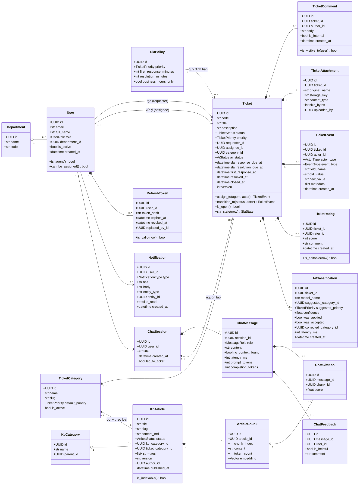
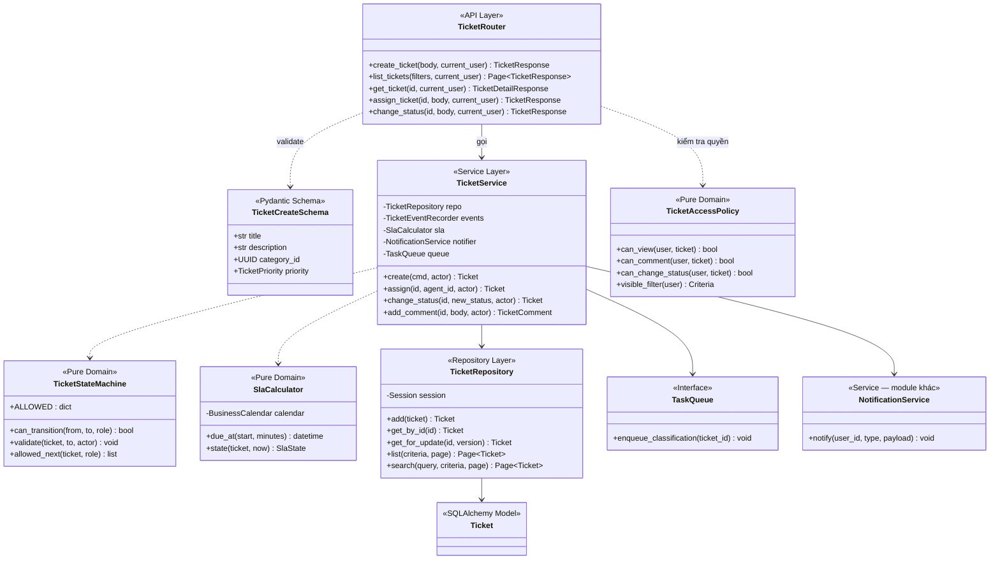
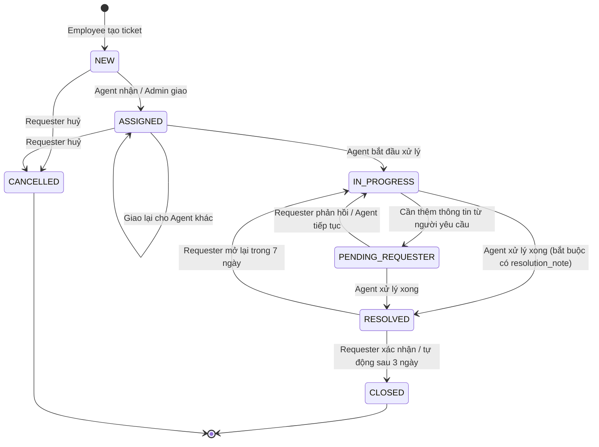
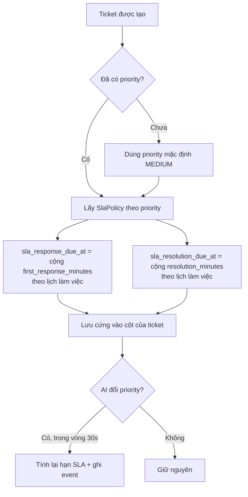

# 03 — Mô hình Miền nghiệp vụ, Sơ đồ Lớp & Quy tắc Nghiệp vụ

| | |
|---|---|
| Phiên bản | 1.0 |
| Đầu vào | `01-requirement-analysis.md`, `02-user-stories.md` |
| Đầu ra | Sơ đồ lớp miền nghiệp vụ, máy trạng thái, quy tắc nghiệp vụ bất biến — là đầu vào cho `04-erd-and-database.md` |

---

## 1. Từ điển thuật ngữ (Ubiquitous Language)

Cả nhóm **phải dùng đúng các từ này** trong code, trong API, trong bảng dữ liệu và khi trao đổi. Dùng nhiều tên cho cùng một khái niệm là nguồn gốc của lỗi tích hợp.

| Thuật ngữ | Tiếng Việt | Định nghĩa chính xác |
|---|---|---|
| **Ticket** | Yêu cầu hỗ trợ | Một yêu cầu hỗ trợ IT có vòng đời, có người chịu trách nhiệm và có hạn xử lý. Đơn vị công việc trung tâm của hệ thống. |
| **Requester** | Người yêu cầu | Người tạo ticket. Luôn là người dùng đang đăng nhập, không bao giờ lấy từ payload. |
| **Assignee** | Người xử lý | IT Agent chịu trách nhiệm chính. Một ticket có **tối đa một** assignee tại một thời điểm. |
| **Category** | Loại sự cố | Phân loại nghiệp vụ của ticket (Mạng, Phần cứng, Tài khoản...). Do người dùng chọn hoặc AI gán. |
| **Priority** | Mức ưu tiên | `LOW / MEDIUM / HIGH / URGENT`. Quyết định hạn SLA. |
| **Status** | Trạng thái | Vị trí của ticket trong vòng đời. Chỉ đổi qua các bước chuyển hợp lệ (§5). |
| **SLA** | Cam kết mức dịch vụ | Hai mốc thời gian: hạn phản hồi đầu tiên và hạn giải quyết, suy ra từ `priority`. |
| **First Response** | Phản hồi đầu tiên | Hành động **đầu tiên của Agent** trên ticket (bình luận công khai hoặc đổi trạng thái). Mốc này chỉ ghi một lần, không bao giờ ghi đè. |
| **Ticket Event** | Sự kiện ticket | Một bản ghi bất biến mô tả một thay đổi. Bảng chỉ ghi thêm, là nguồn sự thật cho lịch sử và báo cáo. |
| **KB Article** | Bài viết kho tri thức | Tài liệu hướng dẫn nội bộ. Chỉ bài `PUBLISHED` mới được nhân viên đọc và mới vào chỉ mục RAG. |
| **Chunk** | Đoạn văn bản | Một mẩu nhỏ của bài viết kèm vector embedding — đơn vị truy xuất của RAG. |
| **Citation** | Trích dẫn | Liên kết từ một câu trả lời của chatbot tới chunk/bài viết đã dùng để tạo ra câu trả lời đó. |
| **Classification** | Kết quả phân loại | Một lần AI phân loại một ticket, kèm độ tin cậy. Lưu lại để đo chất lượng AI. |
| **Rating** | Đánh giá | Điểm hài lòng 1–5 của người yêu cầu sau khi ticket được giải quyết. Mỗi ticket một đánh giá. |
| **Department** | Phòng ban | Đơn vị tổ chức của người dùng. Dùng cho báo cáo và **là khoá phân vùng dữ liệu dự phòng** (xem §9). |

**Các từ cấm dùng** vì gây nhầm lẫn: "task" (dùng `ticket`), "user" khi ý là "employee" (dùng đúng vai trò), "issue", "request" (mơ hồ), "close" khi ý là "resolve" (hai trạng thái khác nhau).

---

## 2. Bóc tách chức năng (Functional Decomposition)

Từ 8 Feature → các năng lực nghiệp vụ (capability) → các lớp chịu trách nhiệm. Bảng này là cầu nối giữa yêu cầu và code, và là căn cứ để chia module ở tài liệu 05.

| Feature | Năng lực nghiệp vụ | Lớp/Thành phần chịu trách nhiệm | Ghi chú |
|---|---|---|---|
| F1 | Xác thực danh tính | `AuthService`, `PasswordHasher`, `TokenService` | Không chứa logic nghiệp vụ ticket |
| F1 | Quản lý phiên | `TokenService`, `RefreshTokenRepository` | Xoay vòng token, phát hiện tái sử dụng |
| F1 | Kiểm soát truy cập | `PermissionPolicy`, dependency `require_role`, `TicketAccessPolicy` | **Tách riêng khỏi service** để test được độc lập |
| F1 | Quản trị người dùng | `UserService`, `UserRepository` | |
| F2 | Vòng đời ticket | `TicketService`, `TicketStateMachine` | Máy trạng thái là lớp thuần, không chạm DB |
| F2 | Giao việc | `TicketAssignmentService` | Xử lý tranh chấp bằng optimistic lock |
| F2 | Trao đổi trên ticket | `CommentService` | |
| F2 | Tệp đính kèm | `AttachmentService`, `FileStorage` (interface) | `FileStorage` có 2 cài đặt: local / S3 |
| F2 | Nhật ký thay đổi | `TicketEventRecorder` | Ghi cùng transaction với thay đổi |
| F2, F6 | Tính hạn SLA | `SlaCalculator` (lớp thuần, không I/O) | Xử lý giờ hành chính + ngày nghỉ |
| F3 | Phân loại ticket | `TicketClassifier` (interface) → `LlmTicketClassifier` | Có cài đặt `RuleBasedClassifier` để dự phòng và để test |
| F3 | Gợi ý người xử lý | `AssigneeRecommender` | **Luật thuần, không gọi LLM** |
| F3 | Đo chất lượng AI | `AiMetricsService` | |
| F4 | Truy xuất ngữ cảnh | `Retriever`, `EmbeddingClient` (interface) | |
| F4 | Sinh câu trả lời | `ChatService`, `LlmClient` (interface), `PromptBuilder` | |
| F4 | Hội thoại | `ChatSessionRepository`, `ChatMessageRepository` | |
| F5 | Quản lý bài viết | `ArticleService`, `ArticleRepository` | |
| F5 | Chỉ mục hoá | `IndexingService`, `TextChunker` | Chạy bất đồng bộ |
| F5 | Tìm kiếm | `ArticleSearchRepository` | PostgreSQL full-text |
| F6 | Sinh thông báo | `NotificationService`, `NotificationDispatcher` | |
| F6 | Giám sát SLA | `SlaMonitorJob` | Job định kỳ, phải idempotent |
| F7 | Tổng hợp số liệu | `ReportService`, `ReportQueryRepository` | Chỉ đọc, dùng SQL gộp |
| F8 | Đánh giá | `RatingService` | |

### Nguyên tắc phân tách trách nhiệm

1. **Máy trạng thái, tính SLA, tính điểm gợi ý là các lớp thuần (pure)** — không nhận session DB, không gọi mạng. Nhận vào dữ liệu, trả ra kết quả. Nhờ vậy chúng được unit test đầy đủ mà không cần database, và đây chính là phần logic dễ sai nhất.
2. **Mọi thứ chạm ra ngoài quy trình đều nằm sau một interface** (`LlmClient`, `EmbeddingClient`, `FileStorage`, `NotificationChannel`). Test dùng cài đặt giả (fake), không mock thư viện bên thứ ba.
3. **Chính sách truy cập tách khỏi service nghiệp vụ.** `TicketService.get()` không tự hỏi "người này có được xem không"; nó nhận vào một `AccessContext` đã được kiểm tra. Nhờ vậy quy tắc phân quyền nằm ở **một chỗ duy nhất** và có thể liệt kê hết bằng test.

---

## 3. Sơ đồ lớp — Mô hình miền nghiệp vụ (Domain Model)

Đây là sơ đồ thực thể ở mức thiết kế hướng đối tượng. ERD ở mức dữ liệu nằm ở tài liệu 04.

### Ghi chú về quan hệ

| Quan hệ | Kiểu | Lý do |
|---|---|---|
| `Ticket` — `TicketComment/Attachment/Event/Rating` | **Composition** (`*--`) | Không tồn tại độc lập ngoài ticket. Xoá ticket (nếu có) thì xoá theo. |
| `Ticket` — `User` (requester/assignee) | **Association** | User tồn tại độc lập. **Không xoá cứng User** vì ticket tham chiếu. |
| `Ticket` — `TicketCategory` | Association, nullable | Ticket có thể chưa được phân loại. |
| `KbArticle` — `ArticleChunk` | **Composition** | Chunk là dữ liệu dẫn xuất, tái tạo được từ bài viết. Xoá/republish bài ⇒ xoá và tạo lại chunk. |
| `SlaPolicy` — `Ticket` | **Dependency** (`..>`) | Ticket **sao chép** hạn SLA vào cột riêng lúc tạo, không tính lại theo policy hiện hành. Đổi policy về sau không được làm thay đổi hạn của ticket cũ — nếu không, báo cáo lịch sử sẽ sai. |

---

## 4. Sơ đồ lớp — Kiến trúc phân tầng (lát cắt Ticket)

Sơ đồ trên là *cái gì*. Sơ đồ dưới là *code được tổ chức thế nào* — mẫu này áp dụng giống hệt cho mọi module.

### Quy tắc bắt buộc giữa các tầng

| Quy tắc | Vì sao |
|---|---|
| Router **không** chứa logic nghiệp vụ, chỉ: validate → gọi service → ánh xạ response | Để logic được tái sử dụng cho worker/CLI, và để test service không cần HTTP |
| Router **không** truy cập `Repository` trực tiếp | Nếu không, quy tắc nghiệp vụ sẽ bị lách qua |
| Service **không** biết gì về HTTP (không `Request`, không `HTTPException`) | Service ném `DomainError`; một exception handler ở tầng API dịch sang mã HTTP |
| Repository **không** chứa logic nghiệp vụ, chỉ truy vấn và ánh xạ | Giữ SQL ở một chỗ, tránh rò rỉ điều kiện nghiệp vụ vào tầng dữ liệu |
| Repository trả về **model/entity**, không trả về Pydantic schema | Schema là hợp đồng của tầng API, không phải của tầng dữ liệu |
| Chỉ Service được mở/đóng transaction | Tránh nửa vời: một phần ghi được, một phần không |
| Lớp thuần (`StateMachine`, `SlaCalculator`, `AccessPolicy`) **không** nhận `Session` | Để unit test không cần DB |

---

## 5. Máy trạng thái Ticket

### Bảng bước chuyển hợp lệ

Đây là **nguồn sự thật duy nhất**, được cài đặt trong `TicketStateMachine.ALLOWED` và phải có unit test phủ **toàn bộ** các ô, kể cả các ô bị cấm.

| Từ \ Đến | NEW | ASSIGNED | IN_PROGRESS | PENDING_REQ | RESOLVED | CLOSED | CANCELLED |
|---|---|---|---|---|---|---|---|
| **NEW** | — | Agent, Admin | ✗ | ✗ | ✗ | ✗ | Requester, Admin |
| **ASSIGNED** | ✗ | Agent, Admin (giao lại) | Assignee, Admin | ✗ | ✗ | ✗ | Requester, Admin |
| **IN_PROGRESS** | ✗ | Admin (giao lại) | — | Assignee | Assignee, Admin | ✗ | Admin |
| **PENDING_REQUESTER** | ✗ | ✗ | Assignee, Requester | — | Assignee, Admin | ✗ | Admin |
| **RESOLVED** | ✗ | ✗ | Requester (≤ 7 ngày), Admin | ✗ | — | Requester, Hệ thống (3 ngày), Admin | ✗ |
| **CLOSED** | ✗ | ✗ | ✗ | ✗ | ✗ | — | ✗ |
| **CANCELLED** | ✗ | ✗ | ✗ | ✗ | ✗ | ✗ | — |

**Bất biến (invariants)** — luôn đúng, kiểm tra bằng test:
1. `status = ASSIGNED/IN_PROGRESS/PENDING_REQUESTER/RESOLVED` ⇒ `assignee_id IS NOT NULL`
2. `status = RESOLVED/CLOSED` ⇒ `resolved_at IS NOT NULL` và `resolution_note` không rỗng
3. `status = CLOSED` ⇒ `closed_at IS NOT NULL` và `closed_at >= resolved_at`
4. `first_response_at` một khi đã có thì **không bao giờ đổi**
5. `CLOSED` và `CANCELLED` là trạng thái cuối — không có bước chuyển đi ra (trừ reopen từ `RESOLVED`, không phải từ `CLOSED`)
6. Chỉ ticket ở `RESOLVED` hoặc `CLOSED` mới được đánh giá
7. Mỗi lần đổi trạng thái sinh **đúng một** bản ghi `ticket_events`

**Vì sao tách `RESOLVED` và `CLOSED`?** `RESOLVED` = Agent tin là đã xong; `CLOSED` = người yêu cầu xác nhận (hoặc hết hạn chờ). Khoảng giữa hai trạng thái này là nơi phát sinh reopen, và là chỗ để hỏi đánh giá. Gộp làm một sẽ mất khả năng đo "tỉ lệ ticket bị mở lại" — một chỉ số chất lượng quan trọng.

---

## 6. Quy tắc tính SLA

### Chính sách SLA mặc định (dữ liệu seed)

| Priority | Hạn phản hồi đầu tiên | Hạn giải quyết | Ví dụ |
|---|---|---|---|
| `URGENT` | 15 phút | 4 giờ làm việc | Mất mạng toàn văn phòng, sự cố bảo mật |
| `HIGH` | 1 giờ | 8 giờ làm việc | Không đăng nhập được hệ thống nghiệp vụ |
| `MEDIUM` | 4 giờ | 24 giờ làm việc | Cài phần mềm, cấp quyền truy cập |
| `LOW` | 8 giờ | 40 giờ làm việc | Yêu cầu tư vấn, đổi thiết bị ngoại vi |

### Quy tắc tính toán

1. **Chỉ tính giờ hành chính**: 8:30–17:30, thứ Hai–thứ Sáu, trừ ngày lễ trong bảng `holidays`. Ticket tạo 17:00 thứ Sáu với SLA 4 giờ có hạn là 11:30 thứ Hai, **không phải** 21:00 thứ Sáu.
   > Nếu PO trả lời câu hỏi Q4 là "24/7" thì `SlaCalculator` chỉ cần cộng thẳng — logic đơn giản hơn nhiều. Đây là lý do phải hỏi PO sớm.
2. **Thời gian ở trạng thái `PENDING_REQUESTER` không tính vào SLA giải quyết** (đang chờ người dùng, không phải lỗi Agent). Cài đặt: cộng dồn vào cột `paused_duration_seconds` mỗi lần rời khỏi trạng thái đó, và trừ ra khi đánh giá vi phạm.
3. **Hạn SLA được lưu cứng vào ticket**, không tính lại từ policy mỗi lần đọc. Đổi policy chỉ ảnh hưởng ticket tạo mới.
4. `SlaCalculator` là **lớp thuần**: nhận `(start_time, minutes, calendar)` → trả `datetime`. Không chạm DB ⇒ test được các ca biên (cuối tuần, ngày lễ, qua đêm, đúng 17:30) mà không cần fixture.

### Trạng thái SLA hiển thị

| Trạng thái | Điều kiện | Màu gợi ý |
|---|---|---|
| `ON_TRACK` | Còn > 25% thời gian | Xanh |
| `AT_RISK` | Còn ≤ 25% thời gian | Vàng |
| `BREACHED` | Đã quá `sla_resolution_due_at` mà chưa `RESOLVED` | Đỏ |
| `MET` | Đã `RESOLVED` trước hạn | Xám |

---

## 7. Xử lý tranh chấp đồng thời (Concurrency)

Hệ thống có tải rất thấp (§8 tài liệu 01), nhưng vẫn tồn tại **ba điểm tranh chấp thực sự** vì nhiều người cùng thao tác trên một ticket:

| Tình huống | Rủi ro | Giải pháp |
|---|---|---|
| Hai Agent cùng bấm "Nhận ticket" | Cả hai tưởng mình đang xử lý | **Optimistic lock**: `UPDATE tickets SET assignee_id=..., version=version+1 WHERE id=? AND version=?`. Nếu `rowcount = 0` ⇒ ném `409 CONFLICT` kèm trạng thái mới nhất |
| Agent đổi trạng thái trong khi AI đang ghi kết quả phân loại | AI ghi đè lựa chọn của con người | AI worker chỉ ghi khi `ai_status = PENDING` **và** `category_id IS NULL`, dùng `UPDATE ... WHERE` có điều kiện. Con người luôn thắng |
| Job SLA chạy chồng lần | Gửi thông báo trùng | Cột `sla_warned_at` + `UPDATE ... WHERE sla_warned_at IS NULL` ⇒ job **idempotent**, chạy lại không sinh trùng |

**Không dùng pessimistic lock (`SELECT FOR UPDATE`)** trên đường phản hồi API: xung đột hiếm, và giữ khoá qua nhiều bước dễ gây deadlock. Ngoại lệ duy nhất là job sinh mã ticket tuần tự (dùng PostgreSQL sequence, không dùng khoá).

---

## 8. Quy tắc nghiệp vụ tổng hợp

Đánh mã để test case và code review tham chiếu tới.

| Mã | Quy tắc | Cưỡng chế ở đâu |
|---|---|---|
| BR-01 | `requester_id` luôn là người đang đăng nhập, không lấy từ payload | `TicketService.create` |
| BR-02 | Chỉ người dùng vai trò `IT_AGENT` đang hoạt động mới được làm assignee | `TicketAssignmentService` + FK + kiểm tra ở service |
| BR-03 | Bước chuyển trạng thái phải nằm trong bảng §5 | `TicketStateMachine` |
| BR-04 | Chuyển sang `RESOLVED` bắt buộc `resolution_note` ≥ 10 ký tự | `TicketService` + CHECK constraint |
| BR-05 | `first_response_at` chỉ ghi một lần, không ghi đè | `TicketService`, có test |
| BR-06 | Mỗi ticket tối đa một đánh giá | UNIQUE constraint trên `ticket_ratings.ticket_id` |
| BR-07 | Chỉ đánh giá ticket `RESOLVED`/`CLOSED`, và chỉ requester được đánh giá | `RatingService` |
| BR-08 | Sửa đánh giá chỉ trong 24 giờ đầu | `TicketRating.is_editable()` |
| BR-09 | Employee chỉ thấy ticket của mình; truy cập ticket khác trả `404` | `TicketAccessPolicy` |
| BR-10 | Bình luận nội bộ (`is_internal`) không hiển thị cho Employee | `TicketComment.is_visible_to()` + lọc ở repository |
| BR-11 | Chỉ bài viết `PUBLISHED` được index và được nhân viên đọc | `ArticleService`, `IndexingService` |
| BR-12 | Gỡ/archive bài viết ⇒ xoá chunk ngay | `IndexingService`, có test |
| BR-13 | AI không ghi đè phân loại do con người chọn | `ClassificationWorker` (điều kiện trong câu UPDATE) |
| BR-14 | `confidence < 0,6` ⇒ không tự áp dụng, chuyển hàng chờ thủ công | `ClassificationWorker` |
| BR-15 | AI hỏng không được chặn vòng đời ticket | Thiết kế bất đồng bộ + `ai_status = FAILED` |
| BR-16 | Không xoá cứng `User`, `Ticket`, `TicketEvent` | Không có API xoá; chỉ vô hiệu hoá |
| BR-17 | `ticket_events` là append-only | Không có endpoint sửa/xoá; quyền DB chỉ cho INSERT/SELECT |
| BR-18 | Không tự gửi thông báo cho người vừa thực hiện hành động | `NotificationService.notify` |
| BR-19 | Hạn SLA lưu cứng lúc tạo, đổi policy không ảnh hưởng ticket cũ | `TicketService.create` |
| BR-20 | Mã ticket `HD-YYYYMM-NNNN` là duy nhất và không tái sử dụng | Sequence + UNIQUE constraint |

---

## 9. Phân vùng dữ liệu — quyết định sớm dù chưa dùng

Hệ thống hiện phục vụ **một tổ chức** (đã ghi là non-goal ở tài liệu 01). Tuy nhiên:

- Mọi bảng nghiệp vụ chính (`tickets`, `kb_articles`, `chat_sessions`) đều **có sẵn cột `department_id`** (nullable, suy ra từ người tạo).
- Mục đích trước mắt: lọc báo cáo theo phòng ban, và trả lời câu hỏi Q1 (nhân viên có xem được ticket cùng phòng ban không) **mà không cần migration**.
- Mục đích lâu dài: nếu về sau cần multi-tenant, `department_id` là khoá phân vùng có sẵn.

Chi phí bây giờ: một cột. Chi phí nếu thêm sau khi có dữ liệu thật: một cuộc migration có backfill và sửa toàn bộ truy vấn. **Đây là ví dụ điển hình của quyết định một chiều — quyết bây giờ thì rẻ.**

---

## 10. Những gì mô hình này **không** giải quyết

Ghi lại để không ai tưởng là đã có:

- **Ticket cha–con / gộp ticket trùng**: chưa có. Nếu cần, thêm `parent_ticket_id` (tự tham chiếu) — không phá vỡ mô hình hiện tại.
- **Nhiều người cùng xử lý một ticket (collaborators)**: hiện chỉ có một assignee. Nếu cần, thêm bảng `ticket_watchers`.
- **Ticket theo mẫu (template) cho các yêu cầu lặp lại**: chưa có, là ứng viên tốt cho phiên bản 2.
- **Chuyển leo thang tự động (auto-escalation) khi vi phạm SLA**: hiện chỉ thông báo, không tự đổi assignee/priority.
- **Phiên bản của bài viết KB**: thiết kế đã chừa `version`, nhưng bảng lịch sử là `Could`.
