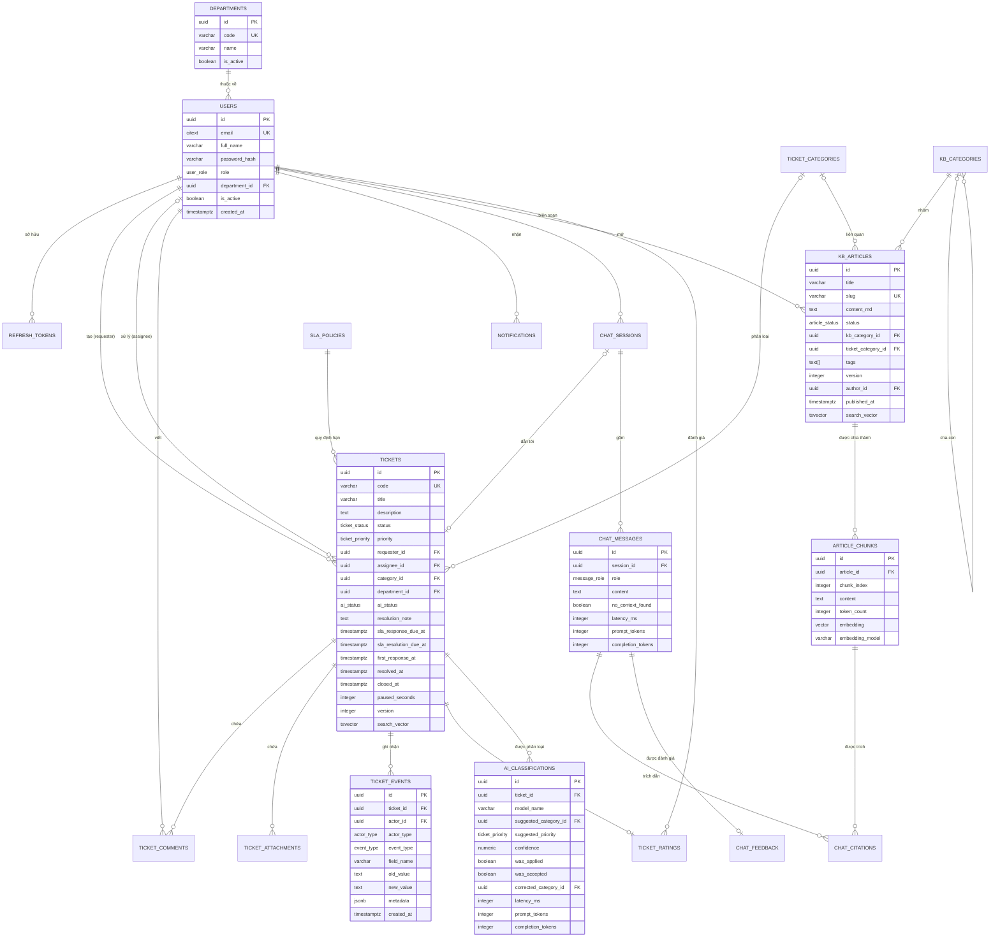

# 04 — Thiết kế Cơ sở dữ liệu (ERD, Schema, Index)

| | |
|---|---|
| Phiên bản | 1.0 |
| Hệ quản trị | PostgreSQL 16 + extension `pgvector`, `pg_trgm`, `uuid-ossp` |
| ORM / Migration | SQLAlchemy 2.x (declarative, kiểu `Mapped[]`) + Alembic |
| Đầu vào | `03-domain-model.md` |
| PIC | Nguyễn Đăng Trường (Database Design), Cao Mạnh Hà (setup & migration) |

> **Nguyên tắc xuyên suốt:** dữ liệu sống lâu hơn code. Ràng buộc đặt được ở tầng database thì đặt ở database — validation ở tầng ứng dụng là trải nghiệm người dùng, ràng buộc ở database mới là thứ thật sự bảo vệ dữ liệu.

---

## 1. Sơ đồ quan hệ thực thể (ERD)



---

## 2. Quy ước chung

| Quy ước | Giá trị | Lý do |
|---|---|---|
| Khoá chính | `UUID` sinh bằng **UUIDv7** ở tầng ứng dụng | Có tính thứ tự theo thời gian ⇒ index B-tree không bị phân mảnh như UUIDv4; không lộ số lượng bản ghi như `SERIAL`; sinh được ở client trước khi ghi DB |
| Kiểu thời gian | `TIMESTAMPTZ`, **luôn lưu UTC** | Tránh mọi lỗi múi giờ; chuyển sang giờ Việt Nam ở tầng hiển thị |
| Tên bảng | số nhiều, `snake_case` | Nhất quán |
| Tên cột thời điểm | hậu tố `_at` | `created_at`, `resolved_at` |
| Cột boolean | tiền tố `is_` / `has_` | `is_active`, `is_internal` |
| Xoá dữ liệu | **Không xoá cứng** bảng nghiệp vụ; dùng `is_active` hoặc trạng thái | Ticket tham chiếu tới user; audit phải giữ được |
| Cột chuẩn | `created_at`, `updated_at` trên mọi bảng có thể sửa | Debug và audit |
| Enum | Dùng **PostgreSQL native ENUM** | Ràng buộc ở tầng DB; thêm giá trị bằng `ALTER TYPE ... ADD VALUE` |
| Chuỗi | `VARCHAR(n)` có giới hạn rõ, không dùng `TEXT` tuỳ tiện | Chặn dữ liệu rác ngay từ DB |

> **Ghi chú về ENUM:** PostgreSQL ENUM không xoá được giá trị và việc thêm giá trị không chạy được trong transaction ở một số phiên bản. Đánh đổi này chấp nhận được vì tập giá trị (trạng thái, vai trò) rất ổn định. Nếu tập giá trị hay thay đổi (ví dụ `notification_type`), dùng `VARCHAR` + `CHECK` — xem ADR-0006.

---

## 3. Định nghĩa kiểu (Enums)

```sql
CREATE TYPE user_role         AS ENUM ('EMPLOYEE', 'IT_AGENT', 'ADMIN');
CREATE TYPE ticket_status     AS ENUM ('NEW', 'ASSIGNED', 'IN_PROGRESS', 'PENDING_REQUESTER',
                                       'RESOLVED', 'CLOSED', 'CANCELLED');
CREATE TYPE ticket_priority   AS ENUM ('LOW', 'MEDIUM', 'HIGH', 'URGENT');
CREATE TYPE ai_status         AS ENUM ('PENDING', 'APPLIED', 'LOW_CONFIDENCE', 'SKIPPED', 'FAILED');
CREATE TYPE actor_type        AS ENUM ('USER', 'SYSTEM', 'AI');
CREATE TYPE event_type        AS ENUM ('CREATED', 'ASSIGNED', 'UNASSIGNED', 'STATUS_CHANGED',
                                       'PRIORITY_CHANGED', 'RECLASSIFIED', 'COMMENTED',
                                       'ATTACHMENT_ADDED', 'AI_CLASSIFIED', 'SLA_WARNED',
                                       'SLA_BREACHED', 'RATED', 'REOPENED', 'AUTO_CLOSED');
CREATE TYPE article_status    AS ENUM ('DRAFT', 'PUBLISHED', 'ARCHIVED');
CREATE TYPE message_role      AS ENUM ('USER', 'ASSISTANT', 'SYSTEM');
```

`notification_type` dùng `VARCHAR(50)` + `CHECK` vì tập giá trị sẽ còn được bổ sung.

---

## 4. Schema chi tiết

### 4.1 Tổ chức & Người dùng

```sql
CREATE TABLE departments (
    id          UUID PRIMARY KEY,
    code        VARCHAR(20)  NOT NULL UNIQUE,
    name        VARCHAR(150) NOT NULL,
    is_active   BOOLEAN      NOT NULL DEFAULT TRUE,
    created_at  TIMESTAMPTZ  NOT NULL DEFAULT now(),
    updated_at  TIMESTAMPTZ  NOT NULL DEFAULT now()
);

CREATE TABLE users (
    id             UUID PRIMARY KEY,
    email          CITEXT       NOT NULL UNIQUE,          -- CITEXT: so sánh không phân biệt hoa/thường
    full_name      VARCHAR(150) NOT NULL,
    password_hash  VARCHAR(255) NOT NULL,
    role           user_role    NOT NULL DEFAULT 'EMPLOYEE',
    department_id  UUID         REFERENCES departments(id) ON DELETE SET NULL,
    phone          VARCHAR(20),
    avatar_url     VARCHAR(500),
    is_active      BOOLEAN      NOT NULL DEFAULT TRUE,
    last_login_at  TIMESTAMPTZ,
    created_at     TIMESTAMPTZ  NOT NULL DEFAULT now(),
    updated_at     TIMESTAMPTZ  NOT NULL DEFAULT now(),

    CONSTRAINT ck_users_email_format CHECK (email ~* '^[^@\s]+@[^@\s]+\.[^@\s]+$'),
    CONSTRAINT ck_users_name_len     CHECK (char_length(full_name) >= 2)
);

-- LƯU Ý THỨ TỰ: bảng này tham chiếu ticket_categories (§4.2) nên phải tạo SAU.
-- Trong Alembic nó nằm ở migration 004 (ticket_catalog), không phải 003.
CREATE TABLE agent_skills (               -- Kỹ năng của IT Agent theo category, phục vụ US-20
    agent_id     UUID NOT NULL REFERENCES users(id) ON DELETE CASCADE,
    category_id  UUID NOT NULL REFERENCES ticket_categories(id) ON DELETE CASCADE,
    level        SMALLINT NOT NULL DEFAULT 1,     -- 1 = biết, 2 = thành thạo, 3 = chuyên gia
    PRIMARY KEY (agent_id, category_id),
    CONSTRAINT ck_skill_level CHECK (level BETWEEN 1 AND 3)
);

CREATE TABLE refresh_tokens (
    id             UUID PRIMARY KEY,
    user_id        UUID        NOT NULL REFERENCES users(id) ON DELETE CASCADE,
    token_hash     VARCHAR(64) NOT NULL UNIQUE,   -- SHA-256 của token, KHÔNG lưu bản rõ
    expires_at     TIMESTAMPTZ NOT NULL,
    revoked_at     TIMESTAMPTZ,
    replaced_by_id UUID        REFERENCES refresh_tokens(id) ON DELETE SET NULL,
    user_agent     VARCHAR(300),
    ip_address     INET,
    created_at     TIMESTAMPTZ NOT NULL DEFAULT now()
);
```

**Vì sao `replaced_by_id`:** phục vụ US-03 — phát hiện token bị đánh cắp. Khi một refresh token **đã bị thay thế** lại được dùng lần nữa, đó là dấu hiệu token rò rỉ ⇒ thu hồi toàn bộ chuỗi token của người dùng.

### 4.2 Danh mục & Chính sách

```sql
CREATE TABLE ticket_categories (
    id               UUID PRIMARY KEY,
    slug             VARCHAR(50)  NOT NULL UNIQUE,
    name             VARCHAR(100) NOT NULL,
    description      TEXT,
    default_priority ticket_priority NOT NULL DEFAULT 'MEDIUM',
    is_active        BOOLEAN      NOT NULL DEFAULT TRUE,
    sort_order       SMALLINT     NOT NULL DEFAULT 0,
    created_at       TIMESTAMPTZ  NOT NULL DEFAULT now()
);

CREATE TABLE sla_policies (
    id                     UUID PRIMARY KEY,
    priority               ticket_priority NOT NULL UNIQUE,
    first_response_minutes INTEGER NOT NULL,
    resolution_minutes     INTEGER NOT NULL,
    business_hours_only    BOOLEAN NOT NULL DEFAULT TRUE,
    updated_at             TIMESTAMPTZ NOT NULL DEFAULT now(),

    CONSTRAINT ck_sla_positive CHECK (first_response_minutes > 0 AND resolution_minutes > 0),
    CONSTRAINT ck_sla_order    CHECK (resolution_minutes >= first_response_minutes)
);

CREATE TABLE holidays (                   -- Ngày nghỉ, dùng cho SlaCalculator
    holiday_date DATE PRIMARY KEY,
    name         VARCHAR(150) NOT NULL
);
```

### 4.3 Ticket — bảng trung tâm

```sql
CREATE SEQUENCE ticket_code_seq START 1;

CREATE TABLE tickets (
    id                    UUID PRIMARY KEY,
    code                  VARCHAR(20)  NOT NULL UNIQUE,
    title                 VARCHAR(200) NOT NULL,
    description           TEXT         NOT NULL,
    status                ticket_status   NOT NULL DEFAULT 'NEW',
    priority              ticket_priority NOT NULL DEFAULT 'MEDIUM',

    requester_id          UUID NOT NULL REFERENCES users(id) ON DELETE RESTRICT,
    assignee_id           UUID          REFERENCES users(id) ON DELETE RESTRICT,
    category_id           UUID          REFERENCES ticket_categories(id) ON DELETE SET NULL,
    department_id         UUID          REFERENCES departments(id) ON DELETE SET NULL,

    source                VARCHAR(20)  NOT NULL DEFAULT 'WEB',   -- WEB | CHATBOT | API
    chat_session_id       UUID,                                   -- FK thêm ở migration sau (tránh phụ thuộc vòng)

    ai_status             ai_status    NOT NULL DEFAULT 'PENDING',
    resolution_note       TEXT,

    sla_response_due_at   TIMESTAMPTZ,
    sla_resolution_due_at TIMESTAMPTZ,
    first_response_at     TIMESTAMPTZ,
    resolved_at           TIMESTAMPTZ,
    closed_at             TIMESTAMPTZ,
    paused_seconds        INTEGER      NOT NULL DEFAULT 0,
    sla_warned_at         TIMESTAMPTZ,
    sla_breached_at       TIMESTAMPTZ,

    version               INTEGER      NOT NULL DEFAULT 1,        -- optimistic lock
    search_vector         TSVECTOR,

    created_at            TIMESTAMPTZ  NOT NULL DEFAULT now(),
    updated_at            TIMESTAMPTZ  NOT NULL DEFAULT now(),

    -- Các bất biến từ tài liệu 03 §5, cưỡng chế ở tầng database
    CONSTRAINT ck_ticket_title_len   CHECK (char_length(title) BETWEEN 5 AND 200),
    CONSTRAINT ck_ticket_desc_len    CHECK (char_length(description) BETWEEN 10 AND 5000),
    CONSTRAINT ck_ticket_assignee    CHECK (
        status IN ('NEW', 'CANCELLED') OR assignee_id IS NOT NULL),
    CONSTRAINT ck_ticket_resolved    CHECK (
        status NOT IN ('RESOLVED', 'CLOSED')
        OR (resolved_at IS NOT NULL AND char_length(coalesce(resolution_note, '')) >= 10)),
    CONSTRAINT ck_ticket_closed      CHECK (
        status <> 'CLOSED' OR (closed_at IS NOT NULL AND closed_at >= resolved_at)),
    CONSTRAINT ck_ticket_paused      CHECK (paused_seconds >= 0),
    CONSTRAINT ck_ticket_source      CHECK (source IN ('WEB', 'CHATBOT', 'API'))
);
```

**Sinh `code`:**
```sql
-- Gọi ở tầng ứng dụng khi tạo ticket, trong cùng transaction
SELECT 'HD-' || to_char(now() AT TIME ZONE 'UTC', 'YYYYMM')
       || '-' || lpad(nextval('ticket_code_seq')::text, 5, '0');
```
Số thứ tự tăng liên tục (không reset theo tháng) — đơn giản, không bao giờ trùng, không cần khoá. Chấp nhận việc số không bắt đầu từ 1 mỗi tháng.

### 4.4 Các bảng con của Ticket

```sql
CREATE TABLE ticket_comments (
    id           UUID PRIMARY KEY,
    ticket_id    UUID NOT NULL REFERENCES tickets(id) ON DELETE CASCADE,
    author_id    UUID NOT NULL REFERENCES users(id) ON DELETE RESTRICT,
    body         TEXT NOT NULL,
    is_internal  BOOLEAN NOT NULL DEFAULT FALSE,
    edited_at    TIMESTAMPTZ,
    created_at   TIMESTAMPTZ NOT NULL DEFAULT now(),

    CONSTRAINT ck_comment_len CHECK (char_length(body) BETWEEN 1 AND 5000)
);

CREATE TABLE ticket_attachments (
    id            UUID PRIMARY KEY,
    ticket_id     UUID NOT NULL REFERENCES tickets(id) ON DELETE CASCADE,
    comment_id    UUID REFERENCES ticket_comments(id) ON DELETE CASCADE,
    original_name VARCHAR(255) NOT NULL,
    storage_key   VARCHAR(500) NOT NULL UNIQUE,   -- UUID trong object storage, KHÔNG dùng tên gốc
    content_type  VARCHAR(100) NOT NULL,
    size_bytes    BIGINT       NOT NULL,
    checksum_sha256 VARCHAR(64),
    uploaded_by   UUID NOT NULL REFERENCES users(id) ON DELETE RESTRICT,
    created_at    TIMESTAMPTZ  NOT NULL DEFAULT now(),

    CONSTRAINT ck_attach_size CHECK (size_bytes > 0 AND size_bytes <= 10485760)  -- 10 MB
);

-- Bảng CHỈ GHI THÊM. Không có UPDATE, không có DELETE. (BR-17)
CREATE TABLE ticket_events (
    id          UUID PRIMARY KEY,
    ticket_id   UUID NOT NULL REFERENCES tickets(id) ON DELETE CASCADE,
    actor_id    UUID REFERENCES users(id) ON DELETE SET NULL,  -- NULL khi actor_type <> 'USER'
    actor_type  actor_type NOT NULL DEFAULT 'USER',
    event_type  event_type NOT NULL,
    field_name  VARCHAR(50),
    old_value   TEXT,
    new_value   TEXT,
    metadata    JSONB NOT NULL DEFAULT '{}'::jsonb,
    created_at  TIMESTAMPTZ NOT NULL DEFAULT now(),

    CONSTRAINT ck_event_actor CHECK (
        (actor_type = 'USER' AND actor_id IS NOT NULL) OR actor_type <> 'USER')
);

CREATE TABLE ticket_ratings (
    id         UUID PRIMARY KEY,
    ticket_id  UUID NOT NULL UNIQUE REFERENCES tickets(id) ON DELETE CASCADE,  -- BR-06
    rater_id   UUID NOT NULL REFERENCES users(id) ON DELETE RESTRICT,
    agent_id   UUID          REFERENCES users(id) ON DELETE SET NULL,  -- sao chép assignee lúc đánh giá
    score      SMALLINT NOT NULL,
    comment    VARCHAR(1000),
    created_at TIMESTAMPTZ NOT NULL DEFAULT now(),
    updated_at TIMESTAMPTZ NOT NULL DEFAULT now(),

    CONSTRAINT ck_rating_score CHECK (score BETWEEN 1 AND 5)
);
```

> **Vì sao `ticket_ratings.agent_id` là bản sao của `assignee_id`?** Báo cáo điểm hài lòng theo Agent phải phản ánh **người thực sự xử lý lúc đó**. Nếu về sau ticket được giao lại, báo cáo lịch sử không được đổi theo. Đây là **denormalization có chủ đích**, ghi rõ ở đây để không ai "sửa cho gọn".

### 4.5 AI — Phân loại

```sql
CREATE TABLE ai_classifications (
    id                    UUID PRIMARY KEY,
    ticket_id             UUID NOT NULL REFERENCES tickets(id) ON DELETE CASCADE,
    model_name            VARCHAR(100) NOT NULL,
    prompt_version        VARCHAR(20)  NOT NULL,
    suggested_category_id UUID REFERENCES ticket_categories(id) ON DELETE SET NULL,
    suggested_priority    ticket_priority,
    confidence            NUMERIC(4,3),
    reasoning             TEXT,
    was_applied           BOOLEAN NOT NULL DEFAULT FALSE,
    was_accepted          BOOLEAN,                  -- NULL = chưa có kết luận
    corrected_category_id UUID REFERENCES ticket_categories(id) ON DELETE SET NULL,
    corrected_at          TIMESTAMPTZ,
    latency_ms            INTEGER,
    prompt_tokens         INTEGER,
    completion_tokens     INTEGER,
    error_message         TEXT,
    created_at            TIMESTAMPTZ NOT NULL DEFAULT now(),

    CONSTRAINT ck_conf_range CHECK (confidence IS NULL OR confidence BETWEEN 0 AND 1)
);
```

Giữ **mọi** lần phân loại (kể cả thất bại) — đây là nguồn dữ liệu duy nhất cho US-22 và cho việc cải thiện prompt.

### 4.6 Kho tri thức & RAG

```sql
CREATE TABLE kb_categories (
    id         UUID PRIMARY KEY,
    slug       VARCHAR(50)  NOT NULL UNIQUE,
    name       VARCHAR(100) NOT NULL,
    parent_id  UUID REFERENCES kb_categories(id) ON DELETE RESTRICT,
    sort_order SMALLINT NOT NULL DEFAULT 0,
    created_at TIMESTAMPTZ NOT NULL DEFAULT now()
);

CREATE TABLE kb_articles (
    id                 UUID PRIMARY KEY,
    slug               VARCHAR(200) NOT NULL UNIQUE,
    title              VARCHAR(200) NOT NULL,
    summary            VARCHAR(500),
    content_md         TEXT NOT NULL,
    status             article_status NOT NULL DEFAULT 'DRAFT',
    kb_category_id     UUID REFERENCES kb_categories(id) ON DELETE RESTRICT,
    ticket_category_id UUID REFERENCES ticket_categories(id) ON DELETE SET NULL,
    tags               TEXT[] NOT NULL DEFAULT '{}',
    version            INTEGER NOT NULL DEFAULT 1,
    author_id          UUID NOT NULL REFERENCES users(id) ON DELETE RESTRICT,
    view_count         INTEGER NOT NULL DEFAULT 0,
    indexed_at         TIMESTAMPTZ,          -- NULL hoặc < updated_at ⇒ cần re-index
    published_at       TIMESTAMPTZ,
    search_vector      TSVECTOR,
    created_at         TIMESTAMPTZ NOT NULL DEFAULT now(),
    updated_at         TIMESTAMPTZ NOT NULL DEFAULT now(),

    CONSTRAINT ck_article_published CHECK (status <> 'PUBLISHED' OR published_at IS NOT NULL),
    CONSTRAINT ck_article_content   CHECK (char_length(content_md) >= 20)
);

CREATE TABLE article_chunks (
    id              UUID PRIMARY KEY,
    article_id      UUID NOT NULL REFERENCES kb_articles(id) ON DELETE CASCADE,
    chunk_index     INTEGER NOT NULL,
    content         TEXT NOT NULL,
    token_count     INTEGER NOT NULL,
    embedding       VECTOR(1536) NOT NULL,
    embedding_model VARCHAR(100) NOT NULL,
    created_at      TIMESTAMPTZ NOT NULL DEFAULT now(),

    CONSTRAINT uq_chunk UNIQUE (article_id, chunk_index)
);
```

> `article_chunks` là **dữ liệu dẫn xuất** — luôn tái tạo được từ `kb_articles` bằng lệnh `reindex-all`. Nó **không bao giờ** là nguồn sự thật. Backup có thể bỏ qua bảng này.
> Chiều vector `1536` gắn với model embedding đang dùng. Đổi model ⇒ phải đổi chiều ⇒ đây là **migration**, không phải đổi config. Cột `embedding_model` giúp phát hiện chunk cũ lẫn model mới.

### 4.7 Chatbot

```sql
CREATE TABLE chat_sessions (
    id             UUID PRIMARY KEY,
    user_id        UUID NOT NULL REFERENCES users(id) ON DELETE CASCADE,
    title          VARCHAR(200),
    message_count  INTEGER NOT NULL DEFAULT 0,
    led_to_ticket  BOOLEAN NOT NULL DEFAULT FALSE,   -- chỉ số tự phục vụ (G3)
    created_at     TIMESTAMPTZ NOT NULL DEFAULT now(),
    last_message_at TIMESTAMPTZ
);

CREATE TABLE chat_messages (
    id                UUID PRIMARY KEY,
    session_id        UUID NOT NULL REFERENCES chat_sessions(id) ON DELETE CASCADE,
    role              message_role NOT NULL,
    content           TEXT NOT NULL,
    no_context_found  BOOLEAN NOT NULL DEFAULT FALSE,
    model_name        VARCHAR(100),
    latency_ms        INTEGER,
    prompt_tokens     INTEGER,
    completion_tokens INTEGER,
    created_at        TIMESTAMPTZ NOT NULL DEFAULT now()
);

CREATE TABLE chat_citations (
    id         UUID PRIMARY KEY,
    message_id UUID NOT NULL REFERENCES chat_messages(id) ON DELETE CASCADE,
    chunk_id   UUID REFERENCES article_chunks(id) ON DELETE SET NULL,
    article_id UUID NOT NULL REFERENCES kb_articles(id) ON DELETE CASCADE,
    score      NUMERIC(5,4) NOT NULL,
    rank       SMALLINT NOT NULL
);

CREATE TABLE chat_feedback (
    id         UUID PRIMARY KEY,
    message_id UUID NOT NULL UNIQUE REFERENCES chat_messages(id) ON DELETE CASCADE,
    user_id    UUID NOT NULL REFERENCES users(id) ON DELETE CASCADE,
    is_helpful BOOLEAN NOT NULL,
    comment    VARCHAR(500),
    created_at TIMESTAMPTZ NOT NULL DEFAULT now()
);
```

`chat_citations.article_id` được giữ lại **kể cả khi chunk bị xoá** (`chunk_id` SET NULL) — nhờ vậy lịch sử hội thoại vẫn trỏ đúng bài viết sau mỗi lần re-index.

### 4.8 Thông báo & Hạ tầng

```sql
CREATE TABLE notifications (
    id          UUID PRIMARY KEY,
    user_id     UUID NOT NULL REFERENCES users(id) ON DELETE CASCADE,
    type        VARCHAR(50) NOT NULL,
    title       VARCHAR(200) NOT NULL,
    body        VARCHAR(500),
    entity_type VARCHAR(30),          -- 'TICKET' | 'ARTICLE' | ...
    entity_id   UUID,
    is_read     BOOLEAN NOT NULL DEFAULT FALSE,
    read_at     TIMESTAMPTZ,
    created_at  TIMESTAMPTZ NOT NULL DEFAULT now(),

    CONSTRAINT ck_notif_type CHECK (type IN (
        'TICKET_ASSIGNED', 'TICKET_STATUS_CHANGED', 'TICKET_COMMENTED',
        'TICKET_RESOLVED', 'SLA_AT_RISK', 'SLA_BREACHED', 'RATING_REQUESTED'))
);

CREATE TABLE idempotency_keys (        -- Phục vụ US-08: chống tạo ticket trùng
    key         VARCHAR(100) PRIMARY KEY,
    user_id     UUID NOT NULL REFERENCES users(id) ON DELETE CASCADE,
    endpoint    VARCHAR(100) NOT NULL,
    request_hash VARCHAR(64) NOT NULL,
    response_status SMALLINT,
    response_body JSONB,
    created_at  TIMESTAMPTZ NOT NULL DEFAULT now(),
    expires_at  TIMESTAMPTZ NOT NULL
);
```

---

## 5. Chiến lược Index

Mỗi index dưới đây tương ứng với **một truy vấn có thật** trong tài liệu 06. Index không có truy vấn đi kèm là chi phí ghi vô ích — không được thêm.

### 5.1 Index cho `tickets` (bảng nóng nhất)

```sql
-- Q: "Ticket của tôi" (US-10) — Employee lọc theo requester + status, sắp xếp mới nhất
CREATE INDEX ix_tickets_requester_created
    ON tickets (requester_id, created_at DESC);

-- Q: "Hàng chờ của tôi" (US-12) — Agent, ưu tiên cao và sắp trễ hạn lên trước
CREATE INDEX ix_tickets_assignee_open
    ON tickets (assignee_id, priority DESC, sla_resolution_due_at ASC)
    WHERE status IN ('ASSIGNED', 'IN_PROGRESS', 'PENDING_REQUESTER');

-- Q: "Ticket chưa giao" (US-12)
CREATE INDEX ix_tickets_unassigned
    ON tickets (created_at DESC)
    WHERE assignee_id IS NULL AND status = 'NEW';

-- Q: Job giám sát SLA (US-35) — quét ticket đang mở sắp/đã quá hạn
CREATE INDEX ix_tickets_sla_monitor
    ON tickets (sla_resolution_due_at)
    WHERE status IN ('NEW', 'ASSIGNED', 'IN_PROGRESS', 'PENDING_REQUESTER');

-- Q: Hàng chờ phân loại thủ công + worker AI
CREATE INDEX ix_tickets_ai_pending
    ON tickets (created_at)
    WHERE ai_status IN ('PENDING', 'LOW_CONFIDENCE', 'FAILED');

-- Q: Dashboard/báo cáo gộp theo category + khoảng thời gian (US-37, US-38)
CREATE INDEX ix_tickets_reporting
    ON tickets (created_at, category_id, status, priority);

-- Q: Tra cứu theo mã ticket khi người dùng đọc qua điện thoại
-- (đã có UNIQUE index từ ràng buộc code)

-- Q: Tìm kiếm full-text (US-16)
CREATE INDEX ix_tickets_search ON tickets USING GIN (search_vector);
```

> **Vì sao dùng index bộ phận (partial index) `WHERE status IN (...)`?** Ticket đã đóng chiếm phần lớn bảng theo thời gian nhưng gần như không bao giờ xuất hiện trong hàng chờ. Index bộ phận nhỏ hơn nhiều, nằm gọn trong bộ nhớ, và **không phải cập nhật khi ticket đã đóng bị sửa**. Đây là kỹ thuật đáng dùng nhất cho bảng có vòng đời rõ ràng như thế này.

### 5.2 Index các bảng còn lại

```sql
-- Bảng con của ticket: luôn truy vấn theo ticket_id
CREATE INDEX ix_comments_ticket    ON ticket_comments (ticket_id, created_at);
CREATE INDEX ix_attachments_ticket ON ticket_attachments (ticket_id);
CREATE INDEX ix_events_ticket      ON ticket_events (ticket_id, created_at);
CREATE INDEX ix_events_type_time   ON ticket_events (event_type, created_at);  -- báo cáo

-- Người dùng
CREATE INDEX ix_users_role_active  ON users (role) WHERE is_active = TRUE;
CREATE INDEX ix_users_department   ON users (department_id) WHERE is_active = TRUE;
CREATE INDEX ix_users_name_trgm    ON users USING GIN (full_name gin_trgm_ops);  -- tìm gần đúng

-- Refresh token: tra theo hash khi refresh; dọn token hết hạn
CREATE INDEX ix_rt_user_active     ON refresh_tokens (user_id) WHERE revoked_at IS NULL;
CREATE INDEX ix_rt_expires         ON refresh_tokens (expires_at);

-- Thông báo: đếm chưa đọc là truy vấn chạy 30s/lần cho MỌI người dùng đang online
CREATE INDEX ix_notifications_unread
    ON notifications (user_id, created_at DESC) WHERE is_read = FALSE;
CREATE INDEX ix_notifications_user  ON notifications (user_id, created_at DESC);

-- Kho tri thức
CREATE INDEX ix_articles_published
    ON kb_articles (published_at DESC) WHERE status = 'PUBLISHED';
CREATE INDEX ix_articles_category   ON kb_articles (kb_category_id) WHERE status = 'PUBLISHED';
CREATE INDEX ix_articles_search     ON kb_articles USING GIN (search_vector);
CREATE INDEX ix_articles_tags       ON kb_articles USING GIN (tags);
CREATE INDEX ix_articles_stale      ON kb_articles (indexed_at)
    WHERE status = 'PUBLISHED';       -- tìm bài cần re-index

-- Vector search cho RAG
CREATE INDEX ix_chunks_embedding ON article_chunks
    USING hnsw (embedding vector_cosine_ops) WITH (m = 16, ef_construction = 64);
CREATE INDEX ix_chunks_article   ON article_chunks (article_id);

-- Chat
CREATE INDEX ix_chat_sessions_user ON chat_sessions (user_id, created_at DESC);
CREATE INDEX ix_chat_messages_sess ON chat_messages (session_id, created_at);
CREATE INDEX ix_chat_msg_nocontext ON chat_messages (created_at)
    WHERE no_context_found = TRUE;    -- US-27: câu hỏi không có tài liệu

-- AI metrics
CREATE INDEX ix_ai_class_ticket ON ai_classifications (ticket_id, created_at DESC);
CREATE INDEX ix_ai_class_report ON ai_classifications (created_at, was_accepted);

-- Đánh giá
CREATE INDEX ix_ratings_agent   ON ticket_ratings (agent_id, created_at DESC);

-- Idempotency
CREATE INDEX ix_idem_expires    ON idempotency_keys (expires_at);
```

> **Về index HNSW cho pgvector:** với 3.600 chunk, quét tuần tự cũng chỉ mất vài mili-giây — index chưa thật sự cần. Vẫn tạo vì chi phí bằng không ở quy mô này và tránh phải sửa khi kho tài liệu lớn lên. `m = 16, ef_construction = 64` là mặc định hợp lý; chỉ tinh chỉnh khi đo được vấn đề.

### 5.3 Full-text search tiếng Việt

```sql
-- Dùng cấu hình 'simple' vì PostgreSQL không có bộ phân tích hình thái tiếng Việt sẵn.
-- unaccent() cho phép gõ "mat khau" tìm ra "mật khẩu" — quan trọng với người dùng Việt.
CREATE EXTENSION IF NOT EXISTS unaccent;

CREATE OR REPLACE FUNCTION tickets_search_trigger() RETURNS trigger AS $$
BEGIN
    NEW.search_vector :=
        setweight(to_tsvector('simple', unaccent(coalesce(NEW.title, ''))), 'A') ||
        setweight(to_tsvector('simple', unaccent(coalesce(NEW.description, ''))), 'B');
    RETURN NEW;
END $$ LANGUAGE plpgsql;

CREATE TRIGGER trg_tickets_search
    BEFORE INSERT OR UPDATE OF title, description ON tickets
    FOR EACH ROW EXECUTE FUNCTION tickets_search_trigger();
```

Trigger tương tự cho `kb_articles` (`title` trọng số A, `summary` B, `content_md` C). Khi truy vấn cũng phải `unaccent()` chuỗi tìm kiếm. Xem **ADR-0004** để biết vì sao không dùng Elasticsearch.

---

## 6. Dữ liệu khởi tạo (Seed)

Chạy bằng `alembic` data migration hoặc script `scripts/seed.py`, **phải idempotent** (chạy nhiều lần không sinh trùng).

| Bảng | Dữ liệu |
|---|---|
| `departments` | IT, Nhân sự, Kế toán, Kinh doanh, Kỹ thuật, Marketing |
| `ticket_categories` | `network` (Mạng & Internet), `hardware` (Phần cứng & Thiết bị), `software` (Phần mềm & Ứng dụng), `account` (Tài khoản & Mật khẩu), `access` (Cấp quyền truy cập), `email` (Email & Lịch), `security` (Bảo mật) `default_priority=HIGH`, `other` (Khác) |
| `sla_policies` | 4 dòng theo bảng ở tài liệu 03 §6 |
| `holidays` | Ngày lễ Việt Nam năm hiện tại |
| `users` | 1 Admin (`admin@company.com`), 3 IT Agent, 5 Employee — **chỉ ở môi trường dev/staging**, mật khẩu lấy từ biến môi trường, không hardcode |
| `kb_categories` | Hướng dẫn chung, Mạng, Phần mềm, Tài khoản, Bảo mật |
| `kb_articles` | **15–20 bài thật** về các sự cố phổ biến — đây là dữ liệu quyết định chất lượng demo RAG, cần đầu tư nội dung nghiêm túc, không phải lorem ipsum |
| `tickets` | ~60 ticket giả rải trong 60 ngày, đủ trạng thái/priority/category — để dashboard có gì mà hiển thị khi demo |

> **Ưu tiên cao cho Sprint 0:** bộ 15–20 bài KB và 60 ticket mẫu. Không có dữ liệu này thì đến ngày demo, dashboard trống trơn và chatbot không có gì để trả lời. Đây là việc làm được ngay từ ngày 1, song song với việc code.

---

## 7. Vòng đời & lưu trữ dữ liệu

| Bảng | Thời gian giữ | Cách xử lý sau đó |
|---|---|---|
| `tickets`, `ticket_comments`, `ticket_events` | 3 năm | Chuyển sang bảng lưu trữ (archive), giữ nguyên `ticket_events` để audit |
| `ticket_attachments` | 1 năm sau khi ticket đóng | Xoá blob khỏi object storage, giữ metadata |
| `refresh_tokens` | Xoá sau khi hết hạn 30 ngày | Job dọn hằng ngày |
| `idempotency_keys` | 24 giờ | Job dọn hằng giờ |
| `notifications` | 90 ngày | Xoá cứng — không có giá trị lịch sử |
| `chat_messages` | 1 năm | Xoá; giữ lại số liệu tổng hợp |
| `article_chunks` | Không giới hạn | Dữ liệu dẫn xuất, tái tạo được bất cứ lúc nào |
| `ai_classifications` | 2 năm | Giữ để phân tích chất lượng mô hình |

### Phân loại dữ liệu nhạy cảm

| Mức | Dữ liệu | Yêu cầu |
|---|---|---|
| **Bí mật** | `users.password_hash`, `refresh_tokens.token_hash` | Không bao giờ log, không bao giờ trả về API, không đưa vào backup dạng rõ |
| **Thông tin cá nhân (PII)** | `users.email`, `full_name`, `phone`, `refresh_tokens.ip_address` | Mã hoá khi truyền (TLS), giới hạn truy cập theo vai trò, có quyền xoá theo yêu cầu |
| **Nhạy cảm nghiệp vụ** | `tickets.description`, `ticket_comments.body`, `ticket_attachments` | Có thể chứa mật khẩu người dùng vô tình dán vào ⇒ **cảnh báo trên giao diện** + không đưa nội dung ticket vào prompt của chatbot công khai |
| **Nội bộ** | Còn lại | Bảo vệ bằng phân quyền thông thường |

---

## 8. Kế hoạch migration

### 8.1 Thứ tự migration ban đầu (Sprint 0 — Cao Mạnh Hà)

| # | Migration | Nội dung |
|---|---|---|
| 001 | `enable_extensions` | `uuid-ossp`, `citext`, `pg_trgm`, `unaccent`, `vector` |
| 002 | `create_enums` | Toàn bộ ENUM ở §3 |
| 003 | `core_identity` | `departments`, `users`, `refresh_tokens` |
| 004 | `ticket_catalog` | `ticket_categories`, `sla_policies`, `holidays`, `agent_skills` |
| 005 | `tickets` | `tickets` + sequence + trigger search |
| 006 | `ticket_children` | `ticket_comments`, `ticket_attachments`, `ticket_events`, `ticket_ratings` |
| 007 | `knowledge_base` | `kb_categories`, `kb_articles`, `article_chunks` |
| 008 | `chat` | `chat_sessions`, `chat_messages`, `chat_citations`, `chat_feedback` + FK `tickets.chat_session_id` |
| 009 | `ai_and_ops` | `ai_classifications`, `notifications`, `idempotency_keys` |
| 010 | `indexes` | Toàn bộ index ở §5 |
| 011 | `seed_reference_data` | Danh mục, SLA policy, ngày lễ (idempotent) |

**Chia nhỏ như vậy để 5 backend dev có thể làm việc song song** — mỗi người sở hữu một nhóm bảng, ít khả năng xung đột file migration. Quy tắc: **một người duy nhất (Cao Mạnh Hà) chịu trách nhiệm merge các migration** và giữ `down_revision` tuyến tính.

### 8.2 Quy tắc migration về sau

1. **Không bao giờ sửa một migration đã merge vào `develop`.** Sai thì viết migration mới sửa lại.
2. Mọi migration phải có hàm `downgrade()` chạy được — kiểm chứng bằng `alembic upgrade head && alembic downgrade -1 && alembic upgrade head` trong CI.
3. Thêm cột `NOT NULL` vào bảng có dữ liệu ⇒ theo mẫu **expand/contract**: thêm cột nullable → backfill theo lô → đặt `NOT NULL`. Không làm một bước.
4. Tạo index trên bảng lớn dùng `CREATE INDEX CONCURRENTLY` (Alembic: `op.create_index(..., postgresql_concurrently=True)` với `autocommit_block`).
5. Đổi tên cột = **đổi hợp đồng**. Phải qua 4 bước: thêm cột mới → ghi cả hai → chuyển đọc → xoá cột cũ ở sprint sau.

### 8.3 Sao lưu và khôi phục

| Hạng mục | Quyết định |
|---|---|
| Tần suất backup | `pg_dump` hằng ngày lúc 2:00 UTC (9:00 giờ VN — ngoài giờ cao điểm nội bộ) |
| Nơi lưu | Object storage, giữ 14 bản |
| RPO / RTO | 24 giờ / 4 giờ (§7 tài liệu 01) |
| **Diễn tập khôi phục** | **Bắt buộc chạy thử ít nhất một lần trong Sprint 2** và ghi lại thời gian thực tế. Một bản backup chưa từng được khôi phục thì chưa phải là backup. |
| Bỏ qua khi backup | `article_chunks` (tái tạo được), `idempotency_keys`, `notifications` cũ |

---

## 9. Ước tính kích thước sau 3 năm

| Bảng | Số dòng | Kích thước dữ liệu | Index | Tổng |
|---|---|---|---|---|
| `tickets` | 28.800 | 43 MB | 25 MB | 68 MB |
| `ticket_comments` | 172.800 | 86 MB | 20 MB | 106 MB |
| `ticket_events` | 345.600 | 86 MB | 40 MB | 126 MB |
| `chat_messages` | 907.200 | 635 MB | 60 MB | 695 MB |
| `article_chunks` | 3.600 | 22 MB | 8 MB | 30 MB |
| `notifications` (giữ 90 ngày) | ~50.000 | 12 MB | 6 MB | 18 MB |
| `ai_classifications` | 28.800 | 15 MB | 5 MB | 20 MB |
| Còn lại | | | | ~20 MB |
| **Tổng PostgreSQL** | | | | **≈ 1,1 GB** |
| Object storage (file đính kèm) | 7.200 file | | | **≈ 11 GB** |

**Kết luận:** một instance PostgreSQL nhỏ nhất (1 vCPU / 2 GB RAM / 20 GB SSD) là đủ cho toàn bộ vòng đời 3 năm. **Không cần** partition, không cần sharding, không cần read replica. Nếu ai đề xuất thêm những thứ này, hãy đối chiếu lại bảng trên.

---

## 10. Truy vấn mẫu quan trọng

Kèm theo để reviewer đối chiếu với index ở §5. Mọi truy vấn dưới đây phải cho ra `Index Scan` trong `EXPLAIN ANALYZE`, không được `Seq Scan`.

```sql
-- 1. Hàng chờ của Agent (US-12) — dùng ix_tickets_assignee_open
SELECT t.id, t.code, t.title, t.priority, t.status, t.sla_resolution_due_at
FROM tickets t
WHERE t.assignee_id = :agent_id
  AND t.status IN ('ASSIGNED', 'IN_PROGRESS', 'PENDING_REQUESTER')
ORDER BY t.priority DESC, t.sla_resolution_due_at ASC
LIMIT 20 OFFSET 0;

-- 2. Job quét SLA (US-35) — dùng ix_tickets_sla_monitor, idempotent nhờ sla_warned_at
UPDATE tickets
SET sla_warned_at = now()
WHERE status IN ('NEW','ASSIGNED','IN_PROGRESS','PENDING_REQUESTER')
  AND sla_warned_at IS NULL
  AND sla_resolution_due_at IS NOT NULL
  AND now() >= sla_resolution_due_at - (sla_resolution_due_at - created_at) * 0.25
RETURNING id, assignee_id, code, title;

-- 3. Nhận ticket có chống tranh chấp (US-13, BR-02) — optimistic lock
UPDATE tickets
SET assignee_id = :agent_id, status = 'ASSIGNED', version = version + 1, updated_at = now()
WHERE id = :ticket_id AND version = :expected_version AND assignee_id IS NULL
RETURNING *;
-- rowcount = 0  =>  409 TICKET_ALREADY_ASSIGNED

-- 4. AI ghi kết quả phân loại, KHÔNG ghi đè lựa chọn của người (BR-13)
UPDATE tickets
SET category_id = :cat, priority = :prio, ai_status = 'APPLIED', version = version + 1
WHERE id = :ticket_id AND ai_status = 'PENDING' AND category_id IS NULL
RETURNING *;

-- 5. Truy xuất RAG (F4) — chỉ lấy bài đã publish
SELECT c.id, c.content, a.id AS article_id, a.title, a.slug,
       1 - (c.embedding <=> :query_embedding) AS score
FROM article_chunks c
JOIN kb_articles a ON a.id = c.article_id
WHERE a.status = 'PUBLISHED'
ORDER BY c.embedding <=> :query_embedding
LIMIT 5;

-- 6. Dashboard: thời gian xử lý theo category (US-38) — dùng p50/p90, trừ thời gian chờ người dùng
SELECT c.name,
       count(*) AS total,
       percentile_cont(0.5) WITHIN GROUP (
           ORDER BY EXTRACT(EPOCH FROM (t.resolved_at - t.created_at)) - t.paused_seconds
       ) / 3600 AS p50_hours,
       percentile_cont(0.9) WITHIN GROUP (
           ORDER BY EXTRACT(EPOCH FROM (t.resolved_at - t.created_at)) - t.paused_seconds
       ) / 3600 AS p90_hours
FROM tickets t
JOIN ticket_categories c ON c.id = t.category_id
WHERE t.resolved_at IS NOT NULL
  AND t.created_at >= :from_date AND t.created_at < :to_date
GROUP BY c.name
ORDER BY total DESC;

-- 7. Độ chính xác phân loại AI theo tuần (US-22)
SELECT date_trunc('week', created_at) AS week,
       count(*) FILTER (WHERE was_accepted IS TRUE)  AS accepted,
       count(*) FILTER (WHERE was_accepted IS FALSE) AS corrected,
       round(avg(confidence)::numeric, 3)            AS avg_confidence,
       round(100.0 * count(*) FILTER (WHERE was_accepted IS TRUE)
             / nullif(count(*) FILTER (WHERE was_accepted IS NOT NULL), 0), 1) AS accuracy_pct
FROM ai_classifications
WHERE created_at >= now() - interval '90 days'
GROUP BY 1 ORDER BY 1;
```
