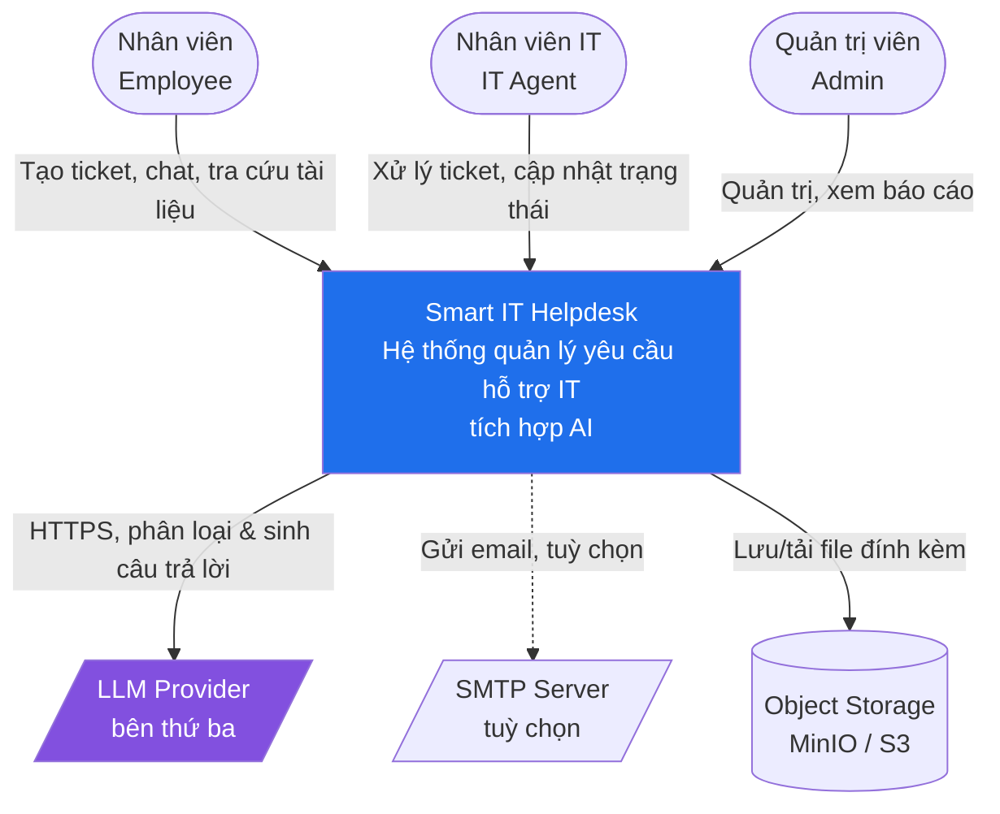
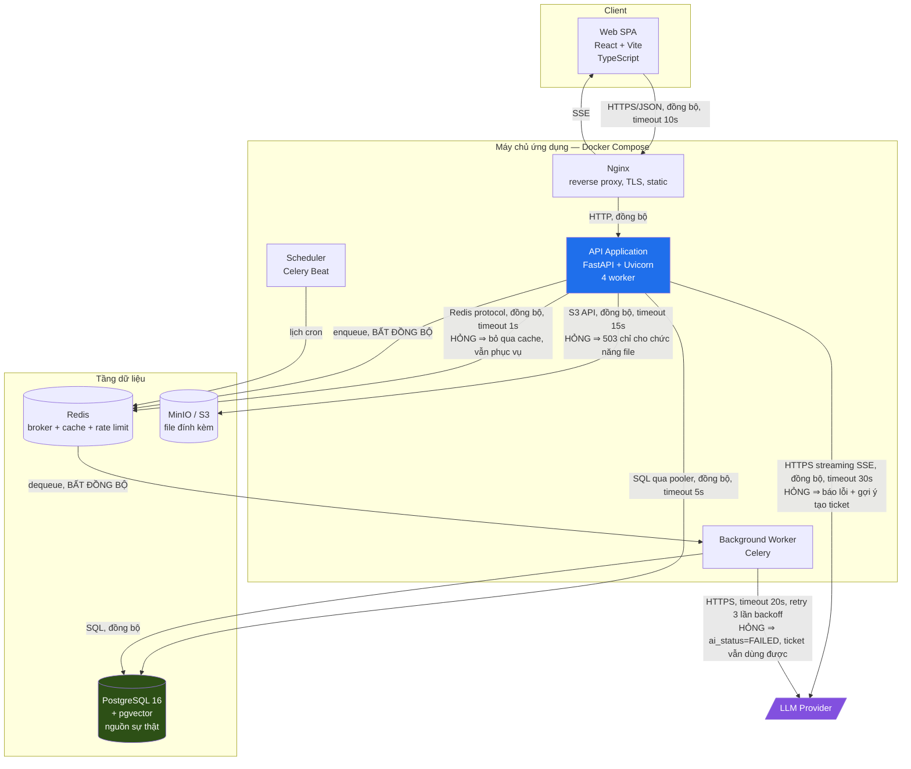
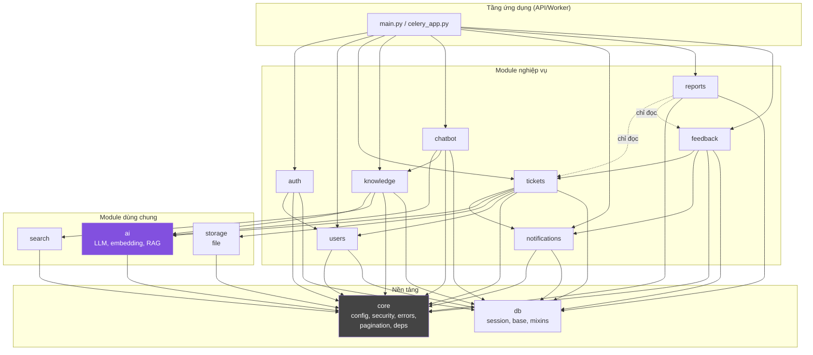
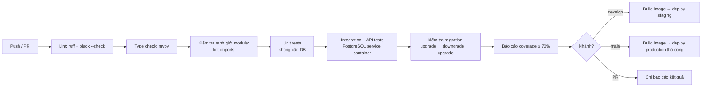

# 05 — Kiến trúc Hệ thống & Phân chia Module/Package

| | |
|---|---|
| Phiên bản | 1.0 |
| Kiến trúc | Modular Monolith, Layered (API → Service → Repository → Model) |
| Đầu vào | `01-requirement-analysis.md` §8 (số liệu tải), `03-domain-model.md` §2 (bóc tách chức năng) |
| PIC | Lại Duy Đông + Chu Quang Vũ (Backend Design), Cao Mạnh Hà (hạ tầng) |

---

## 1. Quyết định kiến trúc tổng thể

**Chọn: Modular Monolith — một ứng dụng FastAPI duy nhất, chia module rõ ràng bên trong, một PostgreSQL, cộng thêm worker nền chạy cùng codebase.**

Căn cứ từ các con số ở tài liệu 01 §8:

| Yếu tố | Số liệu | Hệ quả |
|---|---|---|
| Tải đỉnh | ~1,5 rps (yêu cầu bắt buộc tương đương ~10 rps) | Một tiến trình là đủ, dư 2 bậc độ lớn |
| Dữ liệu 3 năm | 1,1 GB | Một database là đủ |
| Đội ngũ | 9 người, cùng một repo, 4 tuần | Microservices sẽ tiêu tốn phần lớn thời gian vào hạ tầng thay vì tính năng |
| Kinh nghiệm vận hành | Chưa từng chạy K8s/Kafka/service mesh | Chọn công nghệ "nhàm chán, biết chắc" |
| Nút thắt thật sự | LLM provider (2–5 s, có rate limit) | Cần **worker bất đồng bộ**, không cần thêm service |

**Đã cân nhắc và loại bỏ:**

| Phương án | Lý do loại |
|---|---|
| Microservices (auth-service, ticket-service, ai-service...) | Mua về toàn bộ chi phí của hệ phân tán (gọi mạng, transaction phân tán, versioning, tracing) mà không có bất kỳ áp lực nào bắt buộc phải trả. Với 4 tuần, đây là cách chắc chắn nhất để không kịp deadline. |
| Serverless functions | Cold start làm hỏng mục tiêu p95 < 500 ms; kết nối tới PostgreSQL cần pooler; khó chạy job nền dài |
| Tách riêng "AI service" bằng Python khác | Cùng ngôn ngữ, cùng repo ⇒ tách chỉ thêm một biên giới mạng. **Nhưng vẫn tách thành module `ai` với interface rõ ràng**, để nếu sau này cần tách thật thì chỉ việc đổi cách gọi |

> Chi tiết đánh đổi: **ADR-0001**.

---

## 2. Sơ đồ ngữ cảnh (C4 — Level 1)



**Ranh giới tin cậy (trust boundary):** LLM Provider và trình duyệt người dùng nằm **ngoài** ranh giới. Mọi dữ liệu vào từ hai nguồn này đều là dữ liệu không tin cậy — xem tài liệu 08 §1.

---

## 3. Sơ đồ container (C4 — Level 2)

Đây là sơ đồ quan trọng nhất của tài liệu. Mỗi mũi tên đều có **giao thức + đồng bộ/bất đồng bộ + timeout + hành vi khi hỏng**.



### Bảng đặc tả các container

| Container | Công nghệ | Trách nhiệm | Trạng thái | Khi hỏng thì sao |
|---|---|---|---|---|
| Web SPA | React 18 + Vite + TS | Giao diện người dùng | Không trạng thái | Người dùng không truy cập được — toàn bộ hệ thống ngừng với người dùng |
| Nginx | Nginx | TLS, reverse proxy, phục vụ file tĩnh, giới hạn kích thước upload | Không trạng thái | Toàn bộ hệ thống ngừng |
| API Application | FastAPI + Uvicorn | Toàn bộ HTTP API, xác thực, phân quyền, nghiệp vụ | Không trạng thái | Toàn bộ hệ thống ngừng. **Đây là lý do phải chạy ≥ 2 replica ở production** |
| Background Worker | Celery | Phân loại AI, index tài liệu, gửi thông báo, dọn dẹp | Không trạng thái | Ticket vẫn tạo/xử lý được, chỉ mất phần tự động. **Suy giảm chức năng, không sập** |
| Scheduler | Celery Beat | Job định kỳ: quét SLA, tự đóng ticket, dọn token | Có trạng thái nhỏ (lịch) | Mất cảnh báo SLA. Chỉ chạy **một** instance duy nhất |
| PostgreSQL | PostgreSQL 16 + pgvector | **Nguồn sự thật duy nhất** cho mọi dữ liệu | Có trạng thái | Toàn bộ hệ thống ngừng. Điểm hỏng nghiêm trọng nhất ⇒ backup hằng ngày + diễn tập khôi phục |
| Redis | Redis 7 | Broker cho Celery, cache dashboard, đếm rate limit | Có trạng thái (mất được) | Cache mất ⇒ chậm hơn nhưng vẫn đúng. Broker mất ⇒ tác vụ nền đang chờ bị mất (chấp nhận, xem ADR-0007) |
| Object Storage | MinIO (dev) / S3 (prod) | File đính kèm | Có trạng thái | Không upload/tải file được; các chức năng khác bình thường |

### Nguyên tắc rút ra từ sơ đồ

1. **Không có lời gọi LLM nào nằm trên đường phản hồi của API nghiệp vụ.** Chỉ duy nhất API chatbot gọi LLM đồng bộ, và nó stream nên người dùng thấy phản hồi sớm.
2. **Redis không giữ dữ liệu nào là nguồn sự thật.** Xoá sạch Redis thì hệ thống vẫn đúng, chỉ chậm hơn.
3. **Worker và API dùng chung codebase** — cùng model, cùng service, cùng migration. Không có API nội bộ giữa chúng, không có vấn đề versioning.
4. **Mỗi mũi tên ra bên ngoài đều có timeout.** Lời gọi mạng không timeout là rò rỉ tài nguyên không giới hạn và là nguyên nhân số một của sự cố dây chuyền.

---

## 4. Phân chia Module (C4 — Level 3)

### 4.1 Bản đồ module và quyền phụ thuộc



### 4.2 Ma trận phụ thuộc được phép

Đây là **hợp đồng giữa các thành viên trong nhóm**. `✓` = được phép import; ô trống = **cấm**. Vi phạm sẽ bị chặn ở CI (§4.6).

| Từ \ Đến | core | db | ai | storage | search | auth | users | tickets | knowledge | chatbot | notif | reports | feedback |
|---|---|---|---|---|---|---|---|---|---|---|---|---|---|
| **auth** | ✓ | ✓ | | | | — | ✓ | | | | | | |
| **users** | ✓ | ✓ | | | | | — | | | | | | |
| **tickets** | ✓ | ✓ | ✓ | ✓ | ✓ | | ✓ | — | | | ✓ | | |
| **knowledge** | ✓ | ✓ | ✓ | ✓ | ✓ | | ✓ | | — | | | | |
| **chatbot** | ✓ | ✓ | ✓ | | | | ✓ | | ✓ | — | | | |
| **notifications** | ✓ | ✓ | | | | | ✓ | | | | — | | |
| **reports** | ✓ | ✓ | | | | | ✓ | ✓* | ✓* | ✓* | | — | ✓* |
| **feedback** | ✓ | ✓ | | | | | ✓ | ✓ | | | ✓ | | — |
| **ai** | ✓ | ✓ | — | | | | | | | | | | |
| **storage** | ✓ | | | — | | | | | | | | | |

`*` = **chỉ đọc**: `reports` được phép truy vấn model của module khác nhưng **tuyệt đối không được ghi**. Đây là ngoại lệ có chủ đích, đánh đổi giữa sự thuần khiết và sự đơn giản của các truy vấn gộp — viết SQL JOIN thẳng dễ hiểu hơn nhiều so với gọi qua 5 service.

### 4.3 Ba quy tắc vàng khi module gọi nhau

1. **Chỉ được gọi qua `service` của module kia, không bao giờ gọi `repository` hay thao tác trực tiếp `model` của module kia.**
   ```python
   # ĐÚNG — tickets gọi notifications
   from app.modules.notifications.service import NotificationService
   notification_service.notify(user_id=..., type=NotificationType.TICKET_ASSIGNED, ...)

   # SAI — bỏ qua toàn bộ quy tắc nghiệp vụ của module notifications
   from app.modules.notifications.models import Notification
   session.add(Notification(user_id=..., ...))
   ```

2. **`ai` là module hạ tầng, không chứa nghiệp vụ.** Nó cung cấp `LlmClient`, `EmbeddingClient`, `Retriever`. Việc "phân loại ticket" là nghiệp vụ ⇒ `TicketClassifier` nằm ở `tickets`, dùng `LlmClient` từ `ai`. Nhờ vậy đổi LLM provider không đụng tới logic ticket.

3. **Không import vòng.** Nếu A cần B và B cần A ⇒ hoặc là ranh giới sai (gộp lại), hoặc là cần một sự kiện (module thứ ba). Với dự án này, giải pháp đơn giản nhất: module cấp thấp hơn định nghĩa interface, module cấp cao hơn cài đặt và tiêm vào lúc khởi động.

### 4.4 Cấu trúc thư mục đầy đủ

```
smart-it-helpdesk/
├── docker-compose.yml
├── docker-compose.prod.yml
├── .env.example
├── README.md
├── docs/                              # Tài liệu thiết kế (chính là thư mục này)
│
├── backend/
│   ├── pyproject.toml
│   ├── alembic.ini
│   ├── Dockerfile
│   ├── migrations/                    # Alembic
│   │   └── versions/
│   ├── scripts/
│   │   ├── seed.py                    # Dữ liệu khởi tạo (idempotent)
│   │   └── reindex_kb.py              # Dựng lại toàn bộ chỉ mục RAG
│   │
│   ├── app/
│   │   ├── main.py                    # Khởi tạo FastAPI, đăng ký router, middleware
│   │   ├── celery_app.py              # Khởi tạo Celery, đăng ký task, lịch beat
│   │   │
│   │   ├── core/                      # ── NỀN TẢNG: không phụ thuộc module nào ──
│   │   │   ├── config.py              # Pydantic Settings, đọc từ biến môi trường
│   │   │   ├── security.py            # hash mật khẩu, tạo/giải mã JWT
│   │   │   ├── dependencies.py        # get_current_user, require_role, get_db
│   │   │   ├── exceptions.py          # DomainError và các lớp con
│   │   │   ├── error_handlers.py      # Ánh xạ DomainError → HTTP response
│   │   │   ├── pagination.py          # Page[T], PageParams
│   │   │   ├── logging.py             # Cấu hình log JSON có request_id
│   │   │   ├── middleware.py          # RequestID, thời gian xử lý, CORS
│   │   │   └── rate_limit.py
│   │   │
│   │   ├── db/
│   │   │   ├── base.py                # DeclarativeBase, quy ước đặt tên constraint
│   │   │   ├── session.py             # engine, SessionLocal, get_session
│   │   │   ├── mixins.py              # TimestampMixin, UUIDPrimaryKeyMixin
│   │   │   └── types.py               # kiểu tuỳ chỉnh (Vector, CIText)
│   │   │
│   │   ├── modules/                   # ── MODULE NGHIỆP VỤ ──
│   │   │   ├── auth/
│   │   │   │   ├── router.py           # POST /auth/register, /login, /refresh, /logout
│   │   │   │   ├── schemas.py          # LoginRequest, TokenResponse, ...
│   │   │   │   ├── service.py          # AuthService
│   │   │   │   ├── repository.py       # RefreshTokenRepository
│   │   │   │   ├── models.py           # RefreshToken
│   │   │   │   ├── exceptions.py       # InvalidCredentials, TokenReused, ...
│   │   │   │   └── constants.py
│   │   │   │
│   │   │   ├── users/
│   │   │   │   ├── router.py · schemas.py · service.py · repository.py
│   │   │   │   ├── models.py           # User, Department, AgentSkill
│   │   │   │   └── policies.py         # Quy tắc: ai được quản trị ai
│   │   │   │
│   │   │   ├── tickets/                # ── MODULE LỚN NHẤT ──
│   │   │   │   ├── router.py           # /tickets, /tickets/{id}/comments, ...
│   │   │   │   ├── schemas.py
│   │   │   │   ├── service.py          # TicketService
│   │   │   │   ├── assignment.py       # TicketAssignmentService + AssigneeRecommender
│   │   │   │   ├── comments.py         # CommentService
│   │   │   │   ├── attachments.py      # AttachmentService
│   │   │   │   ├── classification.py   # TicketClassifier (dùng ai.LlmClient)
│   │   │   │   ├── repository.py       # TicketRepository, CommentRepository, ...
│   │   │   │   ├── models.py           # Ticket, TicketComment, TicketEvent, ...
│   │   │   │   ├── state_machine.py    # ★ LỚP THUẦN — không I/O
│   │   │   │   ├── sla.py              # ★ SlaCalculator — LỚP THUẦN
│   │   │   │   ├── policies.py         # ★ TicketAccessPolicy — LỚP THUẦN
│   │   │   │   ├── events.py           # TicketEventRecorder
│   │   │   │   ├── tasks.py            # Celery task: classify_ticket, auto_close
│   │   │   │   ├── exceptions.py
│   │   │   │   └── constants.py
│   │   │   │
│   │   │   ├── knowledge/
│   │   │   │   ├── router.py · schemas.py · service.py · repository.py · models.py
│   │   │   │   ├── indexing.py         # IndexingService (chia chunk + embedding)
│   │   │   │   ├── chunker.py          # ★ TextChunker — LỚP THUẦN
│   │   │   │   └── tasks.py            # Celery task: index_article, reindex_all
│   │   │   │
│   │   │   ├── chatbot/
│   │   │   │   ├── router.py           # POST /chat/sessions/{id}/messages (SSE)
│   │   │   │   ├── schemas.py · repository.py · models.py
│   │   │   │   ├── service.py          # ChatService — điều phối RAG
│   │   │   │   └── prompts.py          # ★ PromptBuilder + phiên bản prompt
│   │   │   │
│   │   │   ├── notifications/
│   │   │   │   ├── router.py · schemas.py · service.py · repository.py · models.py
│   │   │   │   ├── templates.py        # Nội dung thông báo theo loại
│   │   │   │   └── tasks.py            # send_notification, sla_monitor
│   │   │   │
│   │   │   ├── reports/
│   │   │   │   ├── router.py · schemas.py
│   │   │   │   ├── service.py          # ReportService (có cache)
│   │   │   │   └── queries.py          # SQL gộp, CHỈ ĐỌC
│   │   │   │
│   │   │   └── feedback/
│   │   │       └── router.py · schemas.py · service.py · repository.py · models.py
│   │   │
│   │   ├── ai/                        # ── HẠ TẦNG AI, KHÔNG CHỨA NGHIỆP VỤ ──
│   │   │   ├── llm/
│   │   │   │   ├── base.py             # ★ interface LlmClient (Protocol)
│   │   │   │   ├── openai_client.py    # cài đặt thật
│   │   │   │   └── fake_client.py      # cài đặt giả cho test và cho chế độ offline
│   │   │   ├── embedding/
│   │   │   │   ├── base.py             # ★ interface EmbeddingClient
│   │   │   │   └── openai_embedding.py
│   │   │   ├── retriever.py            # Truy xuất vector + lọc theo ngưỡng
│   │   │   ├── resilience.py           # timeout, retry có jitter, circuit breaker
│   │   │   └── cost_guard.py           # Đếm token, chặn khi vượt ngân sách tháng
│   │   │
│   │   ├── storage/
│   │   │   ├── base.py                 # ★ interface FileStorage
│   │   │   ├── s3_storage.py
│   │   │   └── local_storage.py        # dùng cho test
│   │   │
│   │   └── api/
│   │       ├── v1/router.py            # Gộp toàn bộ router module, tiền tố /api/v1
│   │       └── health.py               # /health/live, /health/ready
│   │
│   └── tests/
│       ├── conftest.py                 # fixture: db tạm, client, user theo vai trò
│       ├── unit/                       # KHÔNG chạm DB — test các lớp thuần ★
│       │   ├── test_state_machine.py
│       │   ├── test_sla_calculator.py
│       │   ├── test_access_policy.py
│       │   ├── test_chunker.py
│       │   └── test_assignee_recommender.py
│       ├── integration/                # Có DB thật (testcontainers hoặc DB test)
│       │   ├── test_ticket_repository.py
│       │   └── test_ticket_service.py
│       ├── api/                        # Test qua HTTP
│       │   ├── test_auth_api.py
│       │   ├── test_ticket_api.py
│       │   └── test_permission_matrix.py   # ★ quét toàn bộ ma trận phân quyền
│       └── fixtures/
│
└── frontend/
    └── (xem tài liệu 09-frontend-design.md)
```

★ = các lớp **thuần, không I/O** — nơi tập trung logic dễ sai nhất, và là nơi phải có độ phủ test cao nhất.

### 4.5 Khuôn mẫu bắt buộc cho mỗi module

Mỗi module nghiệp vụ **phải** có đủ và chỉ các file sau (thiếu thì thiếu, không được đặt tên khác):

| File | Trách nhiệm | Được import gì |
|---|---|---|
| `router.py` | Định nghĩa endpoint, khai báo dependency, ánh xạ response | `schemas`, `service`, `core.dependencies` |
| `schemas.py` | Pydantic model cho request/response. **Không** dùng lại SQLAlchemy model làm response | `core` |
| `service.py` | Toàn bộ logic nghiệp vụ, quản lý transaction | `repository`, `models`, lớp thuần, service của module khác |
| `repository.py` | Truy vấn dữ liệu. Nhận `Session` qua constructor | `models`, `db` |
| `models.py` | SQLAlchemy model | `db.base`, `db.mixins` |
| `exceptions.py` | Lỗi nghiệp vụ của module, kế thừa `core.exceptions.DomainError` | `core.exceptions` |
| `constants.py` | Hằng số, enum của module | — |
| `tasks.py` (nếu có) | Celery task — **chỉ là lớp vỏ mỏng gọi service** | `service` |

**Nguyên tắc về `tasks.py`:** một Celery task không được chứa logic. Nó chỉ: mở session → gọi service → đóng session → xử lý retry. Nhờ vậy cùng một logic chạy được cả trong API lẫn trong worker, và test được mà không cần Celery.

```python
# app/modules/tickets/tasks.py — mẫu đúng
@celery_app.task(bind=True, max_retries=3, autoretry_for=(LlmError,),
                 retry_backoff=True, retry_jitter=True)
def classify_ticket_task(self, ticket_id: str) -> None:
    with session_scope() as session:
        service = build_classification_service(session)
        service.classify(UUID(ticket_id))       # toàn bộ logic nằm ở đây
```

### 4.6 Cưỡng chế ranh giới module bằng CI

Ranh giới chỉ tồn tại nếu có công cụ chặn. Thêm vào CI:

```toml
# pyproject.toml — import-linter
[tool.importlinter]
root_package = "app"

[[tool.importlinter.contracts]]
name = "Kiến trúc phân tầng"
type = "layers"
layers = ["app.modules", "app.ai | app.storage", "app.db", "app.core"]

[[tool.importlinter.contracts]]
name = "Module nghiệp vụ độc lập"
type = "independence"
modules = ["app.modules.auth", "app.modules.knowledge", "app.modules.notifications"]

[[tool.importlinter.contracts]]
name = "Không ai import model của module khác (trừ reports)"
type = "forbidden"
source_modules = ["app.modules.chatbot", "app.modules.notifications", "app.modules.auth"]
forbidden_modules = ["app.modules.tickets.models", "app.modules.tickets.repository"]
```

Chạy `lint-imports` trong pipeline. **Nếu không có bước này, sau 2 tuần với 5 người code song song, ranh giới module sẽ chỉ còn tồn tại trong tài liệu.**

---

## 5. Tiêm phụ thuộc (Dependency Injection)

Dùng cơ chế `Depends` sẵn có của FastAPI — không thêm framework DI nào khác.

```python
# app/core/dependencies.py
def get_db() -> Generator[Session, None, None]:
    with SessionLocal() as session:
        yield session

def get_current_user(
    token: str = Depends(oauth2_scheme),
    db: Session = Depends(get_db),
) -> User:
    ...

def require_role(*roles: UserRole):
    def _guard(user: User = Depends(get_current_user)) -> User:
        if user.role not in roles:
            raise ForbiddenError("Không đủ quyền")
        return user
    return _guard

# app/modules/tickets/dependencies.py
def get_ticket_service(
    db: Session = Depends(get_db),
    notifier: NotificationService = Depends(get_notification_service),
) -> TicketService:
    return TicketService(
        repo=TicketRepository(db),
        events=TicketEventRecorder(db),
        sla=SlaCalculator(BusinessCalendar.from_db(db)),
        notifier=notifier,
        queue=CeleryTaskQueue(),
    )
```

**Nguyên tắc:** mọi phụ thuộc ra bên ngoài (LLM, storage, hàng đợi) đều đi qua **Protocol** (interface). Trong test, tiêm cài đặt giả:

```python
# tests/conftest.py
app.dependency_overrides[get_llm_client] = lambda: FakeLlmClient(
    responses={"phân loại": {"category": "network", "confidence": 0.92}}
)
```

Nhờ vậy **toàn bộ test chạy được mà không cần API key và không tốn tiền** — điều kiện bắt buộc để CI chạy trên mọi PR.

---

## 6. Xử lý lỗi xuyên suốt

```python
# app/core/exceptions.py
class DomainError(Exception):
    code: str = "INTERNAL_ERROR"
    http_status: int = 500
    def __init__(self, message: str, details: Any = None): ...

class NotFoundError(DomainError):       code, http_status = "NOT_FOUND", 404
class ForbiddenError(DomainError):      code, http_status = "FORBIDDEN", 403
class ValidationError(DomainError):     code, http_status = "VALIDATION_ERROR", 422
class ConflictError(DomainError):       code, http_status = "CONFLICT", 409
class RateLimitError(DomainError):      code, http_status = "RATE_LIMITED", 429
class ExternalServiceError(DomainError):code, http_status = "UPSTREAM_ERROR", 502
```

| Quy tắc | Nội dung |
|---|---|
| Service **không** ném `HTTPException` | Service phải dùng được cả trong worker và CLI, nơi không có HTTP |
| Một exception handler duy nhất dịch `DomainError` → response | Đảm bảo mọi lỗi có cùng một hình dạng (xem tài liệu 06 §3) |
| Lỗi ngoài dự kiến ⇒ log đầy đủ stack trace + `request_id`, trả về `500` với thông điệp chung | **Không bao giờ** để lộ chi tiết nội bộ ra client |
| Lỗi từ LLM/S3 ⇒ `ExternalServiceError`, có thông điệp thân thiện | Người dùng cần biết "thử lại sau", không cần biết "connection reset by peer" |

---

## 7. Triển khai (Deployment)

### 7.1 Môi trường phát triển — `docker-compose.yml`

```yaml
services:
  postgres:   # pgvector/pgvector:pg16, volume, healthcheck
  redis:      # redis:7-alpine
  minio:      # minio/minio, console 9001
  api:        # build backend, hot reload, depends_on healthy
  worker:     # cùng image, command: celery -A app.celery_app worker
  beat:       # cùng image, command: celery -A app.celery_app beat
  frontend:   # node:20, vite dev server
```

Mục tiêu: **`git clone` → `cp .env.example .env` → `docker compose up` → chạy được**. Đây là điều kiện để 9 người bắt đầu làm việc trong ngày đầu tiên thay vì mất 2 ngày cài môi trường.

### 7.2 Ba môi trường

| Môi trường | Mục đích | Dữ liệu | Deploy |
|---|---|---|---|
| **local** | Phát triển | Seed giả | `docker compose up` |
| **staging** | Điều kiện Done, demo với Trainer | Seed giả, làm mới mỗi tuần | Tự động khi merge vào `develop` |
| **production** | Bản chính thức nộp | Dữ liệu demo ổn định | Thủ công, khi merge vào `main` |

> Theo DoD của nhóm, một task chỉ được tính Done khi **đã chạy trên staging**. Vì vậy staging phải sẵn sàng từ **cuối Sprint 0**, không phải cuối Sprint 1 — đây là việc trên đường găng (critical path) của Cao Mạnh Hà.

### 7.3 Pipeline CI/CD



Bước D và G là hai bước hay bị bỏ qua nhất nhưng lại bắt đúng hai loại lỗi đắt nhất của dự án này: **ranh giới module bị phá** và **migration không lùi được**.

### 7.4 Chiến lược nhánh Git

Theo Guideline §5.1:

```
main        ← chỉ nhận merge từ develop, mỗi lần merge là một bản phát hành
develop     ← nhánh tích hợp, luôn phải xanh (CI pass)
feature/F2-ticket-crud       ← đặt tên theo mã feature
feature/F4-rag-pipeline
hotfix/fix-login-500
```

Quy ước tên nhánh: `feature/<mã-feature>-<mô-tả-ngắn>`. Mỗi PR: mô tả thay đổi + link thẻ Trello + ít nhất 1 reviewer. **Cấm merge thẳng vào `main`** (bật branch protection trên GitHub).

---

## 8. Khả năng mở rộng — biết trước, không làm trước

Ghi lại để khi ai đó hỏi "sau này scale thế nào?" thì có câu trả lời, mà không phải làm gì bây giờ:

| Nếu tải tăng | Nút thắt xuất hiện ở | Việc phải làm | Ngưỡng kích hoạt |
|---|---|---|---|
| 10× (15 rps) | Không có | Không làm gì. Có thể tăng lên 2 replica API cho tính sẵn sàng | — |
| 50× (75 rps) | Kết nối DB | Thêm PgBouncer, tăng replica API | p95 > 400 ms |
| 100× (150 rps) | Truy vấn dashboard | Bảng tổng hợp (materialized view) làm mới định kỳ | Truy vấn báo cáo > 1 s |
| Chat tăng mạnh | Rate limit của LLM provider | Hàng đợi + cache câu trả lời cho câu hỏi lặp | Xuất hiện lỗi 429 từ provider |
| KB > 50.000 chunk | Vector search | Điều chỉnh tham số HNSW; cân nhắc vector DB riêng | Truy xuất > 200 ms |
| Dữ liệu > 100 GB | Bảng `tickets`, `chat_messages` | Phân vùng theo `created_at` theo tháng | Kích thước bảng > 50 GB |

**Không được làm bất kỳ mục nào ở trên trong phạm vi dự án này.** Mỗi mục có ngưỡng kích hoạt rõ ràng; chưa chạm ngưỡng thì đó là phức tạp không có lý do.
