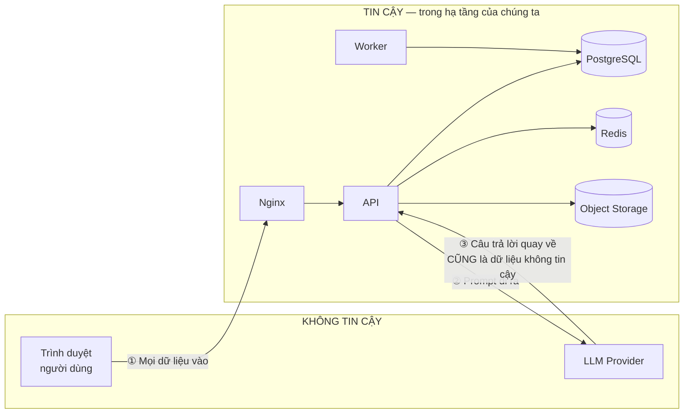

# 08 — Bảo mật, Phân quyền, Quan sát & Vận hành

| | |
|---|---|
| Phiên bản | 1.0 |
| Phạm vi | Các yêu cầu phi chức năng ở tài liệu 01 §7 được cụ thể hoá thành thiết kế |
| PIC | Lại Duy Đông (auth/authz), Cao Mạnh Hà (hạ tầng, CI/CD, giám sát), Trần Quang Ngọc (kiểm thử) |

---

## 1. Mô hình mối đe doạ

### 1.1 Ranh giới tin cậy



| # | Ranh giới | Rủi ro | Biện pháp |
|---|---|---|---|
| ① | Trình duyệt → API | Injection, giả mạo, leo thang quyền | Pydantic validate 100%, ORM tham số hoá, kiểm tra quyền ở mọi endpoint |
| ② | API → LLM | Rò rỉ dữ liệu nội bộ ra bên thứ ba | **Không đưa nội dung ticket của người khác vào prompt chatbot**; chỉ gửi bài KB đã publish + câu hỏi hiện tại |
| ③ | LLM → API | Đầu ra độc hại, prompt injection lan truyền | Ràng buộc JSON schema, kiểm tra giá trị trả về có tồn tại trong DB, làm sạch trước khi render |

### 1.2 Các mối đe doạ chính (rút gọn theo STRIDE)

| Đe doạ | Kịch bản cụ thể | Biện pháp |
|---|---|---|
| **Giả mạo danh tính** | Đánh cắp token, dò mật khẩu | JWT ký HS256/RS256, refresh token xoay vòng + phát hiện tái sử dụng, rate limit đăng nhập, bcrypt cost 12 |
| **Sửa đổi trái phép** | Nhân viên tự đổi `role` của mình bằng cách gửi thêm field | Schema request **không chứa** `role`; `requester_id` lấy từ token; đổi vai trò chỉ qua endpoint riêng của Admin |
| **Chối bỏ hành vi** | "Tôi không hề đóng ticket đó" | `ticket_events` append-only, ghi actor + thời điểm + giá trị trước/sau |
| **Rò rỉ thông tin** | ⚠️ **Nhân viên đọc được ticket của người khác** | Xem §2 — đây là rủi ro nghiêm trọng nhất của hệ thống |
| **Từ chối dịch vụ** | Spam ticket, spam chat làm cạn ngân sách LLM | Rate limit theo người dùng, giới hạn kích thước upload, `cost_guard` |
| **Leo thang đặc quyền** | Employee gọi API dành cho Admin | Kiểm tra vai trò ở tầng dependency + kiểm tra quyền trên từng bản ghi |

---

## 2. Phân quyền — phần rủi ro nhất của hệ thống

Ở quy mô tải này, database và hiệu năng không phải vấn đề. **Rò rỉ dữ liệu giữa người dùng mới là thứ có thể phá hỏng cả hệ thống.** Vì vậy phân quyền được thiết kế thành ba lớp.

### 2.1 Ba lớp kiểm soát

| Lớp | Kiểm tra gì | Cài đặt ở đâu |
|---|---|---|
| **L1 — Xác thực** | Người gọi là ai | `get_current_user` dependency, giải mã JWT |
| **L2 — Quyền theo vai trò** | Vai trò này có được gọi endpoint này không | `require_role(...)` dependency trên router |
| **L3 — Quyền trên bản ghi** | Người này có được đụng vào **bản ghi cụ thể** này không | `TicketAccessPolicy` — lớp thuần, gọi trong service |

**L2 là chưa đủ.** `GET /tickets/{id}` cho phép mọi vai trò gọi — nhưng Employee chỉ được xem ticket của mình. Đó là việc của L3. Bỏ sót L3 là lỗi bảo mật phổ biến nhất trong các hệ thống kiểu này.

### 2.2 Lọc ngay từ truy vấn, không lọc sau khi lấy về

```python
# app/modules/tickets/policies.py — LỚP THUẦN
class TicketAccessPolicy:
    @staticmethod
    def visible_filter(user: User) -> ColumnElement[bool]:
        """Điều kiện WHERE quyết định người dùng ĐƯỢC NHÌN THẤY những ticket nào."""
        if user.role in (UserRole.IT_AGENT, UserRole.ADMIN):
            return true()
        return Ticket.requester_id == user.id          # Employee: chỉ ticket của mình

    @staticmethod
    def can_change_status(user: User, ticket: Ticket, new_status: TicketStatus) -> bool: ...

    @staticmethod
    def can_see_internal_comments(user: User) -> bool:
        return user.role in (UserRole.IT_AGENT, UserRole.ADMIN)
```

```python
# Repository LUÔN nhận điều kiện lọc — không có đường nào lấy dữ liệu mà bỏ qua nó
def list_tickets(self, *, access_filter, criteria, page) -> Page[Ticket]:
    stmt = select(Ticket).where(access_filter).where(*criteria.to_conditions())
    ...
```

**Vì sao lọc trong truy vấn chứ không lọc trong Python:** lấy hết rồi lọc sau sẽ khiến `totalItems` trong phân trang sai, làm lộ số lượng ticket của toàn hệ thống, và chỉ cần một chỗ quên lọc là rò rỉ dữ liệu.

### 2.3 Quy tắc trả `404` thay vì `403`

Employee truy cập ticket không phải của mình ⇒ trả **`404 NOT_FOUND`**, không phải `403`. `403` xác nhận ticket đó tồn tại, cho phép kẻ tấn công dò ID để đếm số ticket của hệ thống. Áp dụng cho mọi tài nguyên thuộc sở hữu cá nhân: ticket, phiên chat, thông báo.

### 2.4 Hai bài test bắt buộc

**Test 1 — không có endpoint nào để hở:**
```python
def test_all_business_endpoints_require_auth(app):
    """Quét TOÀN BỘ route đã đăng ký, khẳng định endpoint nghiệp vụ đều có
    dependency xác thực. Đây là lưới an toàn cho việc thêm endpoint mới mà quên."""
    public = {"/api/v1/auth/login", "/api/v1/auth/register",
              "/api/v1/auth/refresh", "/health/live", "/health/ready", "/docs",
              "/api/v1/openapi.json"}
    for route in app.routes:
        if route.path in public or not route.path.startswith("/api/"):
            continue
        assert has_auth_dependency(route), f"Endpoint {route.path} KHÔNG được bảo vệ!"
```

**Test 2 — ma trận phân quyền:**
```python
@pytest.mark.parametrize("role,method,path,expected", PERMISSION_MATRIX)
def test_permission_matrix(client, role, method, path, expected):
    """Sinh từ bảng ma trận ở tài liệu 06 §5. Mỗi ô có test cho phép VÀ test từ chối."""
    resp = client.request(method, path, headers=auth_header_for(role))
    assert resp.status_code == expected
```

Hai test này bắt được đúng loại lỗi mà code review dễ bỏ sót nhất: **endpoint mới thêm vào mà quên gắn dependency phân quyền**.

---

## 3. Xác thực & quản lý phiên

| Hạng mục | Quyết định | Lý do |
|---|---|---|
| Hash mật khẩu | `bcrypt`, cost 12 | Bắt buộc theo yêu cầu; cost 12 ≈ 250 ms — đủ chậm để chống dò, đủ nhanh cho người dùng |
| Chính sách mật khẩu | ≥ 8 ký tự, có chữ hoa + chữ thường + số | Cân bằng giữa an toàn và trải nghiệm |
| Access token | JWT, 15 phút, chứa `sub`, `role`, `jti` | Ngắn để giảm thiệt hại khi bị lộ; không cần tra DB mỗi request |
| Refresh token | Chuỗi ngẫu nhiên 256-bit (**không phải JWT**), 7 ngày, lưu **hash SHA-256** trong DB | Thu hồi được; DB bị lộ cũng không dùng được token |
| Xoay vòng token | Mỗi lần refresh sinh token mới, thu hồi token cũ | Phát hiện được token bị đánh cắp |
| Phát hiện tái sử dụng | Dùng lại token đã bị thay thế ⇒ **thu hồi toàn bộ chuỗi** | Kẻ tấn công dùng token cũ sẽ vô hiệu hoá cả phiên của chính nạn nhân — nạn nhân biết ngay |
| Không dùng blacklist access token | Đăng xuất không huỷ được access token còn hiệu lực (tối đa 15 phút) | Đánh đổi có chủ đích: tránh phải tra Redis ở **mọi** request. Xem ADR-0003 |
| Lưu ở frontend | Access token trong bộ nhớ; refresh token trong cookie `HttpOnly; Secure; SameSite=Strict` | localStorage bị đọc bởi bất kỳ XSS nào |

---

## 4. Validate và làm sạch dữ liệu vào

| Loại đầu vào | Biện pháp |
|---|---|
| Body JSON | Pydantic v2 với `Field(min_length=..., max_length=...)`, `model_config = ConfigDict(extra="forbid")` — **field lạ bị từ chối**, không âm thầm bỏ qua |
| Tham số truy vấn | Pydantic; `sortBy` chỉ nhận danh sách trắng; `pageSize` chặn ở 100 |
| Tham số đường dẫn | Ép kiểu `UUID` — chuỗi sai định dạng bị chặn trước khi tới service |
| SQL | **Chỉ dùng SQLAlchemy** với tham số hoá. Cấm f-string trong SQL. Nếu buộc phải dùng `text()`, phải dùng `:bindparam` |
| Upload file | Kiểm tra phần mở rộng **và** magic bytes; giới hạn 10 MB (chặn cả ở Nginx `client_max_body_size`); tên lưu là UUID |
| Markdown (bài KB, câu trả lời chatbot) | Làm sạch ở frontend bằng DOMPurify khi render | 
| Xuất CSV | Ô bắt đầu bằng `= + - @` được thêm tiền tố `'` — chống CSV injection |
| Chuỗi cho full-text search | Đi qua `plainto_tsquery`, không ghép chuỗi |

**Chỗ nào cần validate:** biên hệ thống (router, tải file lên, đọc phản hồi từ LLM, đọc biến môi trường).
**Chỗ nào KHÔNG cần:** giữa các hàm nội bộ đã có kiểu rõ ràng, dữ liệu vừa lấy từ chính DB của mình.

---

## 5. Quản lý bí mật

| Quy tắc | Chi tiết |
|---|---|
| Không hardcode | Toàn bộ cấu hình qua biến môi trường, đọc bằng Pydantic `Settings` |
| Không commit | `.env` nằm trong `.gitignore`; chỉ commit `.env.example` với giá trị giả |
| Quét bí mật | Bật `gitleaks` trong CI — chặn PR có API key lọt vào |
| Bí mật production | Đặt trong GitHub Secrets / biến môi trường của nền tảng deploy, không nằm trong repo |
| Không log bí mật | Middleware log **che** các trường `password`, `token`, `authorization`, `api_key` |
| Xoay vòng | Đổi `JWT_SECRET` sẽ vô hiệu hoá mọi access token — chấp nhận được, ghi vào runbook |

Cấu hình bắt buộc: `DATABASE_URL`, `REDIS_URL`, `JWT_SECRET` (≥ 32 ký tự ngẫu nhiên), `LLM_API_KEY`, `S3_*`, `AI_MONTHLY_BUDGET_USD`, `CORS_ORIGINS`, `ENVIRONMENT`.

**Ứng dụng phải từ chối khởi động** nếu thiếu biến bắt buộc hoặc nếu `JWT_SECRET` còn là giá trị mặc định trong môi trường production. Thà không chạy còn hơn chạy với cấu hình không an toàn.

---

## 6. Bảo mật tầng truyền tải & HTTP

| Hạng mục | Cấu hình |
|---|---|
| TLS | Bắt buộc HTTPS ở production (Let's Encrypt); HTTP → HTTPS redirect |
| CORS | Danh sách trắng cụ thể theo môi trường. **Cấm `allow_origins=["*"]` khi có credentials** |
| Security headers | `Strict-Transport-Security`, `X-Content-Type-Options: nosniff`, `X-Frame-Options: DENY`, `Referrer-Policy: same-origin`, `Content-Security-Policy` |
| Tải file xuống | Luôn `Content-Disposition: attachment` + `X-Content-Type-Options: nosniff` — chặn stored XSS qua file HTML/SVG |
| Kích thước request | Nginx `client_max_body_size 12m` (đệm trên mức 10 MB của ứng dụng) |
| Giấu thông tin phiên bản | Tắt `Server` header của Nginx, không lộ phiên bản FastAPI |

---

## 7. Quan sát hệ thống (Observability)

### 7.1 Log

| Quy tắc | Chi tiết |
|---|---|
| Định dạng | JSON một dòng — máy đọc được, `grep` được |
| Trường bắt buộc | `timestamp`, `level`, `message`, `request_id`, `user_id`, `path`, `method`, `status_code`, `duration_ms` |
| `request_id` | Sinh ở middleware, truyền qua toàn bộ ngăn xếp, **truyền cả sang Celery task**, và trả về trong mọi response lỗi |
| Che dữ liệu nhạy cảm | `password`, `token`, `authorization`, `api_key`, `refresh_token` |
| Mức log | `INFO` cho hành động nghiệp vụ, `WARNING` cho lỗi dự đoán được, `ERROR` kèm stack trace cho lỗi ngoài dự kiến |
| Không log | Toàn bộ body request (có thể chứa dữ liệu cá nhân), nội dung ticket ở mức `INFO` |

> `request_id` truyền sang Celery task là chi tiết nhỏ nhưng cực kỳ giá trị: khi phân loại AI sai, có thể lần từ ticket → log worker → prompt đã gửi, chỉ bằng một mã.

### 7.2 Chỉ số (Metrics)

| Nhóm | Chỉ số |
|---|---|
| HTTP | `http_requests_total{method,path,status}`, `http_request_duration_seconds` (histogram) |
| Nghiệp vụ | `tickets_created_total{category,priority}`, `tickets_resolved_total`, `sla_breaches_total`, `chat_sessions_total`, `chat_self_served_total` |
| AI | `llm_requests_total{operation,status}`, `llm_latency_seconds`, `llm_tokens_total{type}`, `ai_classification_accepted_ratio` |
| Hàng đợi | `celery_queue_depth`, `celery_task_duration_seconds`, `celery_task_failures_total` |
| Hạ tầng | Kết nối DB đang dùng, tỉ lệ trúng cache Redis |

### 7.3 Cảnh báo — dựa trên triệu chứng người dùng cảm nhận được

| Cảnh báo | Điều kiện | Mức |
|---|---|---|
| API lỗi cao | Tỉ lệ `5xx` > 5% trong 5 phút | Nghiêm trọng |
| API chậm | p95 > 1 s trong 10 phút | Cảnh báo |
| Database không truy cập được | `/health/ready` fail 3 lần liên tiếp | Nghiêm trọng |
| Hàng đợi ùn | Độ sâu > 100 hoặc tin nhắn cũ nhất > 10 phút | Cảnh báo |
| **Job SLA ngừng chạy** | Không có lần chạy thành công trong 30 phút | Cảnh báo |
| LLM lỗi liên tục | Tỉ lệ lỗi > 50% trong 15 phút | Cảnh báo |
| Ngân sách AI | Đạt 80% ngân sách tháng | Cảnh báo |

> **Cảnh báo trên sự vắng mặt, không chỉ trên lỗi.** Một job định kỳ ngừng chạy sẽ **không sinh ra lỗi nào cả** — nó chỉ im lặng. Đây là loại sự cố khó phát hiện nhất và cần được cảnh báo riêng.

### 7.4 Health check

| Endpoint | Kiểm tra | Dùng cho |
|---|---|---|
| `/health/live` | Tiến trình còn sống. **Không** kiểm tra phụ thuộc | Quyết định khởi động lại container |
| `/health/ready` | `SELECT 1` trên DB (timeout 2 s), `PING` Redis | Quyết định có nhận traffic không |

Tách hai loại là bắt buộc: nếu `live` phụ thuộc database, một sự cố DB ngắn sẽ khiến toàn bộ instance bị khởi động lại đồng loạt, biến sự cố suy giảm thành sự cố sập.

---

## 8. Hiệu năng

| Quyết định | Chi tiết |
|---|---|
| Chống N+1 query | Dùng `selectinload()` cho quan hệ khi trả về danh sách. **Bật `echo=True` ở môi trường dev để nhìn thấy số câu SQL** — N+1 là nguyên nhân số một của API chậm trong dự án kiểu này |
| Phân trang | Bắt buộc ở mọi endpoint danh sách, `pageSize` ≤ 100 |
| Cache | Chỉ cache endpoint báo cáo (TTL 5 phút, Redis). **Không** cache dữ liệu ticket — người dùng cần thấy trạng thái mới nhất |
| Cache hỏng | Bỏ qua cache, đi thẳng DB (fail-open) |
| Kết nối DB | `pool_size=10`, `max_overflow=20`, `pool_pre_ping=True` (chống kết nối chết sau khi DB restart) |
| Timeout truy vấn | `statement_timeout = 5s` ở tầng ứng dụng; báo cáo được phép 15 s |
| Kiểm chứng | `EXPLAIN ANALYZE` cho các truy vấn ở tài liệu 04 §10 với **≥ 30.000 ticket giả** — không kiểm chứng trên 20 dòng dữ liệu |

### Ngân sách độ trễ cho `GET /tickets` (mục tiêu p95 < 300 ms)

| Thành phần | Ngân sách |
|---|---|
| Mạng + Nginx | 20 ms |
| Xác thực (giải mã JWT, không tra DB) | 5 ms |
| Truy vấn danh sách (có index) | 50 ms |
| Truy vấn đếm tổng | 30 ms |
| Nạp quan hệ (`selectinload`) | 40 ms |
| Chuyển đổi Pydantic | 30 ms |
| **Tổng** | **175 ms** — dư 125 ms đệm |

Nếu đo thực tế vượt ngân sách, phần lớn khả năng là N+1 query hoặc thiếu index — kiểm tra hai thứ này trước khi nghĩ tới cache.

---

## 9. Độ tin cậy

| Cơ chế | Cài đặt |
|---|---|
| Timeout | Mọi lời gọi ra ngoài đều có timeout (§3 tài liệu 05). Không có ngoại lệ |
| Thử lại | Chỉ cho thao tác idempotent; backoff mũ **có jitter**; tối đa 3 lần |
| Circuit breaker | Cho LLM provider (§4 tài liệu 07) |
| Vách ngăn | Hàng đợi Celery riêng cho AI và cho thông báo |
| Suy giảm có kiểm soát | LLM hỏng ⇒ mất tự động phân loại. Redis hỏng ⇒ mất cache và rate limit. Object storage hỏng ⇒ mất chức năng file. **Chỉ PostgreSQL hỏng mới làm sập hệ thống** |
| Transaction | Thay đổi ticket và bản ghi `ticket_events` **luôn trong cùng một transaction** |
| Tính idempotent | `Idempotency-Key` cho tạo ticket; cột `sla_warned_at` cho job SLA; điều kiện `WHERE` cho AI worker |

### Bảng phân tích điểm hỏng đơn (SPOF)

| Thành phần | SPOF? | Hệ quả khi hỏng | Xử lý |
|---|---|---|---|
| PostgreSQL | **Có** | Sập toàn bộ | Backup hằng ngày + diễn tập khôi phục. Chấp nhận ở phạm vi dự án này |
| API | Có (1 replica ở dev) | Sập toàn bộ | Chạy 2 replica ở production |
| Redis | Không | Chậm hơn, mất tác vụ nền đang chờ | Chấp nhận |
| Celery Worker | Không | Mất tự động hoá | Chấp nhận, có hàng chờ thủ công |
| Celery Beat | Có (chỉ 1 instance) | Mất cảnh báo SLA | Cảnh báo khi job ngừng chạy (§7.3) |
| LLM Provider | Không | Mất tính năng AI | Có đường dự phòng nhiều tầng |
| Object Storage | Không | Mất chức năng file | Chấp nhận |

**Trung thực về mức sẵn sàng:** với kiến trúc này, SLO thực tế đạt được là khoảng **99,5% trong giờ hành chính**. Muốn cao hơn cần replica database và failover tự động — chi phí không xứng đáng với một hệ thống nội bộ có thể bảo trì ngoài giờ. Đây là quyết định có chủ đích, không phải thiếu sót.

---

## 10. Vận hành

### 10.1 Runbook — các sự cố thường gặp

| Triệu chứng | Kiểm tra đầu tiên | Cách xử lý |
|---|---|---|
| API trả 500 hàng loạt | Log lọc theo `level=ERROR`, lấy `request_id` | Xem stack trace; nếu do deploy thì rollback về image trước |
| API chậm | `pg_stat_activity` tìm truy vấn chạy lâu | Huỷ truy vấn; kiểm tra index; kiểm tra N+1 |
| Ticket không được phân loại | `celery inspect active`, độ sâu hàng đợi | Worker chết? Restart. LLM hỏng? Kiểm tra `ai_status=FAILED` và phân loại tay |
| Chatbot không trả lời | Log `UPSTREAM_ERROR`, trạng thái circuit breaker | Kiểm tra API key, hạn mức, `cost_guard` đã chặn chưa |
| Chatbot trả lời sai/thiếu | `SELECT ... WHERE no_context_found = true` | Bổ sung bài KB; chạy `reindex_kb.py` |
| Không nhận được thông báo SLA | Beat còn chạy không? `sla_warned_at` có được cập nhật? | Restart beat; chạy tay job quét |
| Không upload được file | Trạng thái MinIO/S3, dung lượng còn trống | Kiểm tra credential và bucket policy |
| Hết dung lượng đĩa | `df -h`, kích thước bảng | Dọn `notifications` cũ, xoay vòng log, dọn attachment quá hạn |

### 10.2 Quy trình phát hành

1. Merge vào `develop` ⇒ CI chạy ⇒ tự động deploy staging
2. QA kiểm thử trên staging theo test case
3. Tạo PR `develop` → `main`, review
4. Merge ⇒ deploy production **thủ công** (có người bấm nút)
5. **Chạy migration TRƯỚC khi deploy code mới** (migration phải tương thích ngược với code cũ)
6. Kiểm tra `/health/ready` + xem log 5 phút + thử luồng chính
7. Có vấn đề ⇒ rollback image. **Migration không rollback tự động** — vì vậy migration phải luôn tương thích ngược

### 10.3 Danh sách kiểm tra trước khi nộp bài

- [ ] Toàn bộ biến môi trường production đã đặt, không còn giá trị mặc định
- [ ] `JWT_SECRET` là chuỗi ngẫu nhiên ≥ 32 ký tự, khác staging
- [ ] Tài khoản seed mặc định đã đổi mật khẩu hoặc đã vô hiệu hoá
- [ ] HTTPS hoạt động, HTTP tự chuyển hướng
- [ ] CORS chỉ cho phép đúng domain frontend
- [ ] `/docs` — quyết định công khai hay chặn (nên mở cho việc chấm bài, ghi rõ trong README)
- [ ] Backup đã chạy **và đã khôi phục thử thành công một lần**
- [ ] Log không chứa mật khẩu, token, API key
- [ ] `gitleaks` chạy sạch trên toàn bộ lịch sử repo
- [ ] Rate limit hoạt động (thử đăng nhập sai 6 lần)
- [ ] Ma trận phân quyền pass 100%
- [ ] Có dữ liệu demo đủ để dashboard không trống
- [ ] `reindex_kb.py` đã chạy, chatbot trả lời được các câu trong tập đánh giá
- [ ] Chatbot **từ chối đúng** 5 câu hỏi ngoài phạm vi tài liệu
- [ ] README đủ 7 mục theo Guideline §11
